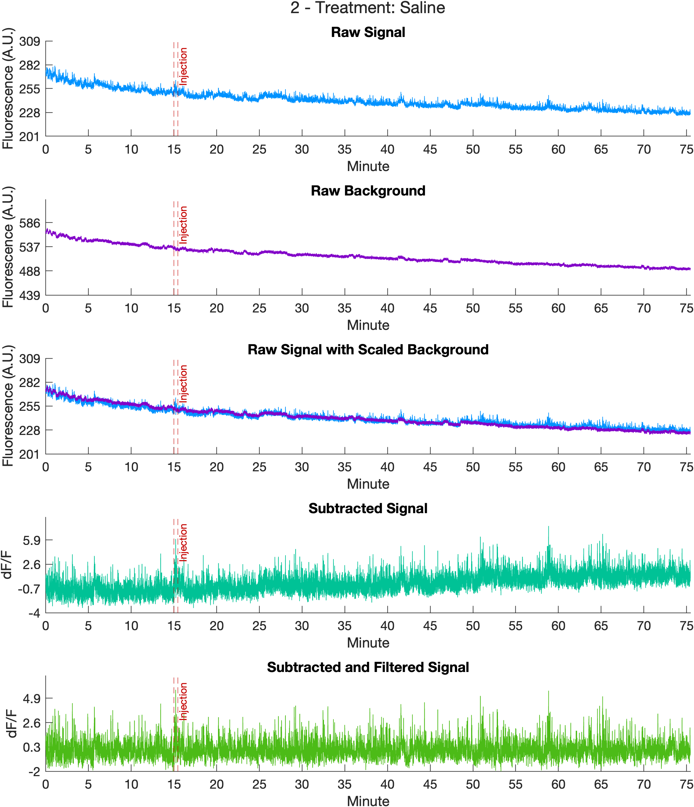
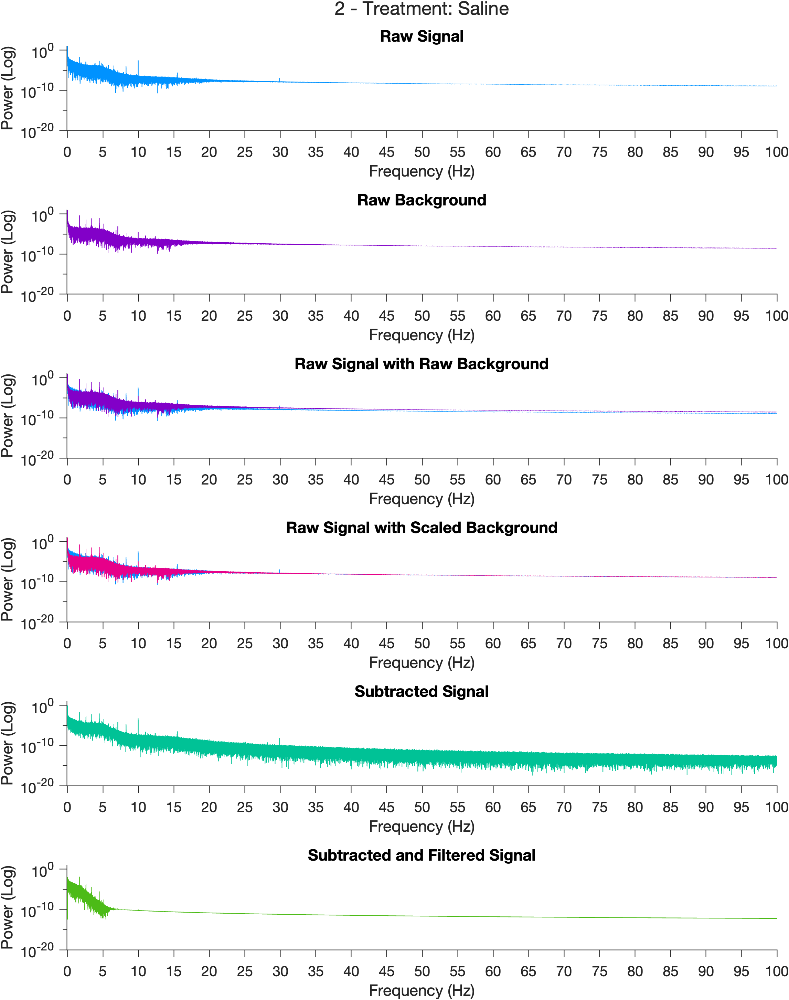
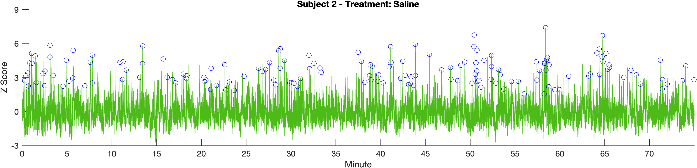
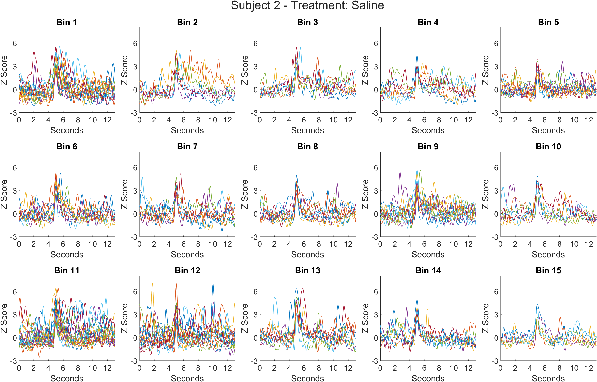
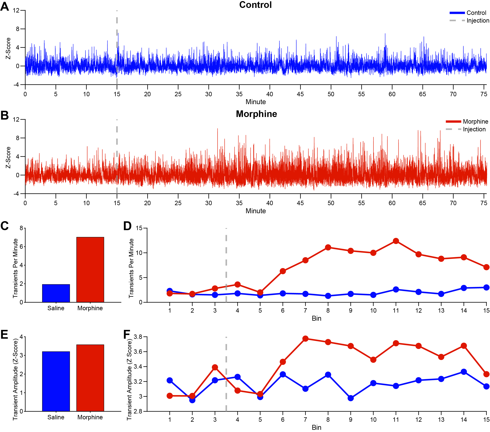

# Example Analysis: Injection Transients
PASTa includes an example analysis with fiber photometry recordings to help users get comfortable with the workflow and observe the effects of each stage of processing on the signal. The analysis script is available on GitHub, and the data are freely accessible on (Box)[https://uofi.app.box.com/s/pqpa8286yi6oia1ocjts7qytb1wetgpv/folder/256973884209] at <https://uofi.app.box.com/s/pqpa8286yi6oia1ocjts7qytb1wetgpv/folder/256973884209> under _Example Analyses_. The subfolder _Injection Transients_ is prepared for the analysis, containing the file and subject keys, as well as folders created for extracted data, analysis, and figure outputs. Raw data blocks collected via Synapse (Tucker Davis Technologies) are nested in the Raw Data folder.The completed analysis output files including extracted data structures, transient quantification, and plots are also available for download.

If you have any questions or run into problems accessing the files, please feel free to [contact us](https://rdonka.github.io/PASTaUserGuide/contactus/).

## Methods
### Overview
Example data are provided from two subjects. Each subject has two fiber photometry sessions conducted on consecutive days: saline and morphine (10mg/kg). Each session consists of a fifteen minute baseline, an intraperitoneal injection, and a 60 minute post-injection recording period. Fiber photometry data were recorded using Tucker Davis Technologies RZ10X processor, with a 465nm excitation wavelength (signal; _'sig'_) and a 405nm isosbestic control wavelength (background, _'baq'_). Injection start and end time points are marked by epochs (_'injt'_) sent through Med Associates equipment and stored by Synapse as time stamps. 

### Animals

Adult male and female Long Evans rats (n = 2) expressing Cre recombinase under the control of the tyrosine hydroxylase promoter (TH:Cre+; [34]) were paired housed within a temperature and humidity-controlled vivarium on a 12:12 hour light-dark cycle with lights on at 7:00 am and maintained on ad libitum food and water for the direction of all experiments. All procedures were conducted in accordance with guidelines set by the National Institutes for Health Guide for the Care and Use of Laboratory Animals and approved by the Animal Care Committee of the University of Illinois Chicago. Recordings were conducted during the light portion of the cycle.

### Stereotaxic Surgery Procedures

Rats were anesthetized via isoflurane (induction: 4%; maintenance: ~2%) and injected with meloxicam (1mg/kg, subcutaneous) prior to the start of stereotaxic surgery. To isolate and record from dopamine neuronal cell bodies, AAV1.hSyn.Flex.GCaMP6f.WPRE.SV40 was targeted to the VTA (Anterior/Posterior (AP): - 5.40mm, Medial/Lateral (ML): +0.70mm, Dorsal/Ventral (DV): -8.15mm, relative to Bregma) of TH:Cre+ rats. Viral injections were performed with a volume of 1μL at a rate of 0.1μL/minute with a blunt 30-gauge injection needle mated to a Hamilton syringe via PEEK tubing and connected to a syringe pump. A 5 minute post-injection period followed to ensure complete virus diffusion. An optic fiber (flat 400-μm core, 0.48 NA, Doric Lenses, Inc.) was implanted above the injection site and secured to three implanted skull screws via metabond and dental cement.

### Fiber Photometry Data Collection

Fiber photometry recordings were performed as in Konanur et al 2020, Hsu et al 2020, and Konanur et al 2024, and Loh et al 2025 [35-38]. Data were collected using data acquisition systems from Tucker Davis Technologies (RZ10X). Implanted fiber optic cannulae of subjects were mated to a patch cord, which was connected through a commutator to a filter cube (FMC4, Doric Lenses). Emitted fluorescence was collected by an external photoreceiver (Visible Femtowatt Photoreceiver Model 2151; Newport) and passed to the data acquisition system for live visualization and recording. LEDs administered 465nm and 405nm wavelengths at a total power output of 30μW. Light was sinusoidally modulated at 211 and 531 Hz respectively. Lock in amplification was used to demodulate the fluorescence by emission wavelength.

Fiber photometry recording sessions were conducted on consecutive days, with the first session consisting of a control saline treatment (1mL/kg, intraperitoneal (i.p.); figure panel A) and the second session consisting of acute morphine treatment (10mg/kg morphine sulfate, i.p.; figure panel B). Each test session consisted of a 15 minute pre-injection baseline, followed by a 60-minute post-injection recording period. Signal processing was performed with PASTa protocol defaults. Subtracted and filtered data streams were normalized to z-score based on the pre-injection baseline period. Transient events were detected at a threshold of 2.6 SDs using PASTa protocol default parameters.

## Analysis Script
The full analysis script is available via the (PASTa GitHub)[https://github.com/rdonka/PASTa] under the subfolder _"Example Analyses"_. Download the file "main_ExampleAnalysis_InjectionTransients.m".

### Data Preparation
The first section of the script sets up paths and analysis key inputs. To enable users to switch computers easily, paths are created without the computer and user specific portion. The computer user specific root directory of the path is input to the variable _rootdirectory_ and appended to subsequently needed paths. 

For users accessing PASTa via cloning the repository, to access files and functions, paths need to be added to MATLAB via the *addpath* function. *genpath* is used within addpath to ensure folders and subfolders at the input path are added. Finally, the names of created Subject and File Keys are added to variables *subjectkeyname* and *filekeyname*. These keys contain the session specific and subject specific information needed to load the data and analyze the results. For details on keys, see the user guide section on [Data Preparation](https://rdonka.github.io/PASTaUserGuide/userguide/datapreparation/).

The keys are loaded using the function *createExperimentKey* to join the subject specific data to the session specific information contained in the file key. Paths to raw data blocks and extracted output locations are added to string arrays, which are input to the function *extractTDTdata*. *extractTDTdata* first extracts the raw data for each file into a data structure, trims the first 5 seconds of the recording, and then saves the MATLAB data structure to extracted output location. Extracted structures for each file are then loaded by the function *loadKeydata*. 

After data are loaded, excess samples before the start of the program and after the end of the post-injection period are cropped from the streams. First, session  start and end indices are prepared for each file. These indices are input to the function *cropFPdata*, which removes the excess samples from the signal and background streams, and adjusts the injection and session start time stamp epocs.

### Signal Processing
To control for motion artifacts and photobleaching, the 405 nm channel (_'baq'_) is subtracted from the 465 nm channel (_'sig'_) with the function *subtractFPdata*. The example analysis script uses the default _'frequency'_ scaling method (see the user guide section (Signal Processing)[https://rdonka.github.io/PASTaUserGuide/userguide/signalprocessing/] for full details and alternative scaling options). 

First, *subtractFPdata* scales the background stream to the signal stream. After scaling, the background is subtracted from the signal in the time domain, and filtered with a Butterworth bandpass filter to remove the DC offset as well as high frequency noise (frequencies outside the range of biological interest). The scaling factor (*'baqscalingfactor'*), subtracted signal (*'sigsub'*), filtered signal (*'sigfilt'*) are added to the data structure.

Raw, subtracted, and filtered streams for the whole session are visualized and saved to the output folder *'Figures'*.

Additionally, frequency magnitude plots of the FFTs of the raw, scaled, subtracted, and filtered streams are generated and saved to the *'Figures'* folder.

### Normalization
After subtraction, the filtered signal is normalized. To normalize to the entire session, the function *normSession* is called, outputting the z scored signal streams to *'sigfiltz_normsession'*. To normalize to pre injection baseline, the function *normBaseline* is called, which uses the pre-injection period to normalize the entire session, outputting the z scored streams to *'sigfiltz_normbaseline'*. 

Finally, a for loop is used to create streams with the injection time period removed. For details on the signal processing functions and methods, see the user guide section on [Signal Processing](https://rdonka.github.io/PASTaUserGuide/userguide/signalprocessing/).

### Transient Detection
To identify transient events, the *findTransients* function is used. This function detects relevant transients in the normalized data stream based on an amplitude inclusion criterion (eg, 2.6 SD) relative to the pre-event baseline. The example analysis uses the default pre-event baseline type (baseline window mean; _'blmean'_) and baseline window parameters. See the user guide section (Transient Analysis)[https://rdonka.github.io/PASTaUserGuide/userguide/transientanalysis/] for more details and optional input parameters. Transient events are output to a separate data structure to facilitate analysis.

After detection, transients are quantified by frequency, amplitude, half height rise time, half height fall time, half height width, and half height AUC. After detection and quantification, transients are binned into 5 minute (default) increments. The function *binTransients* identifies and adds the bin of each transient event to the *transientquantificiation* table. 

Multiple plots are generated to visualize transient events and figures are saved to the _Figures_ folder.

Whole session trace with all transient events:

Individual bin traces with identified transients:

Overlaid Transient Traces from the Whole Session:

Overlaid Transient Traces by Bin:

To export the transient events for statistical analysis, the *summarizeTransients* and *summarizeBinTransients* functions are used to generate the session means of transient event quantification parameters.

## Results

Overall, morphine administration significantly increased the frequency (figure panel C) and amplitude (figure panel E) of VTA DA activity transients relative to the saline control session. The increase in transient frequency and amplitude was observed approximately 10 minutes post-injection (figure panels D and F), and remained elevated relative to both pre-injection baseline and the matched saline control session through the end of the 60-minute post-injection recording.

__Transient Frequency and Amplitude Results.__ Example analysis of VTA DA transient frequency and amplitude after acute morphine administration. Representative examples of pre-injection baseline normalized traces from a single subject before and after __A)__ an injection of saline (control) and __B)__ an injection of morphine (10mg/kg). The vertical dashed line indicates time of injection. __C)__ Mean transient frequency (transients per minute) across the entire session. __D)__ Transient frequency binned in 5-minute time windows. __E)__ Mean transient amplitude (z-score) across the session. __F)__ Transient amplitude binned in 5-minute time windows. Data reflect automated transient detection using PASTa protocol defaults.

Additionally, relative to the matched control session, morphine increased VTA DA activity transient rise duration (figure panels A and B) and decreased VTA DA activity transient fall duration (figure panels C and D). Morphine increased the overall AUC of transients (figure panel E). These trends emerged approximately 10 minutes post-injection and returned to pre-treatment baseline and matched control session levels by the end of the post-injection recording period (figure panels B, D, and F).

__Transient Duration Results__. Example analysis of VTA DA transient event duration and AUC following acute saline (blue, control) and morphine (red) administration. __A)__ Mean transient rise duration (milliseconds) across the full session. __B)__ Transient rise duration binned in 5-minute time windows. __C)__ Mean transient fall duration (milliseconds) across the full session. __D)__ Transient fall duration binned in 5-minute time windows. __E)__ Mean area under the curve (AUC) for transients. __F)__ Transient AUC binned in 5-minute time windows. All duration and AUC metrics were calculated at half-height relative to the peak. Vertical dashed lines in B, D, and F indicate the time of saline or morphine injection.

## Conclusion
Together, this example analysis illustrates the complementary shifts in multiple aspects of transient dynamics, providing a more comprehensive evaluation of the effects of morphine on VTA DA activity. This example is provided to allow users to directly apply PASTa to a real data set and ensure that results are replicated across users of the toolbox.
