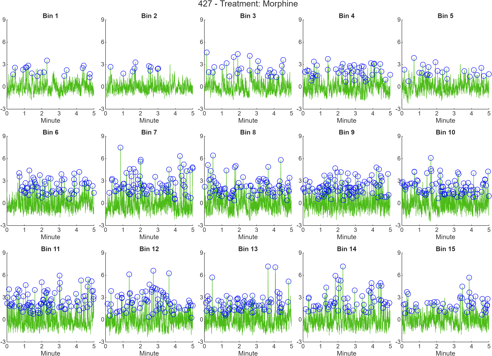

To help users get started with the PASTa Protocol, here some example analyses are included with raw data to walk users through each step of the process.

# Injection Transients
This example is of whole session transient analysis to determine changes in dopaminergic cell body GCaMP6f transients following morphine injection. The example analysis script is located in the PASTa repository under 'Example Analyses\main_ExampleAnalysis_Transients.m'.

## Data Summary
Example data are provided from two subjects. Each subject has two fiber photometry sessions conducted on consecutive days: saline and morphine (10mg/kg). Each session consists of a fifteen minute baseline, an i.p. injection, and a 60 minute post-injection recording period. Fiber photometry data were recorded using Tucker Davis Technologies RZ5 processor, with a 465nm excitation wavelength ('signal') and a 405nm isosbestic control wavelength ('background'). Injection start and end time points are marked by epocs sent through Med Associates equipment and stored by Synapse as time stamps. 

Data are available for download from [Box](https://uofi.box.com/s/pqpa8286yi6oia1ocjts7qytb1wetgpv) under _Example Analyses_. The subfolder _Injection Transients_ is prepared for the analysis, containing the file and subject keys, as well as folders created for extracted data, analysis, and figure outputs. Raw data blocks collected via Synapse (Tucker Davis Technologies) are nested in the Raw Data folder.

**NOTE FOR MAC USERS:** A Mac compatible version of the file key is included in the _Example Analyses_ folder. In your main analysis script, make sure to update the file name to *'FileKey_ExampleAnalysis_MorphineTransients_MAC.csv'*.

If you have any questions or run into problems accessing the files, please feel free to [contact us](https://rdonka.github.io/PASTaUserGuide/contactus/).

## Data Preparation
The first section of the script sets up paths and analysis key inputs. To enable users to switch computers easily, paths are created without the computer and user specific portion. The computer user specific portion of the path is input to the variable computeruserpath and appended to subsequently needed paths. To access files and functions, paths need to be added to MATLAB via the *addpath* function. *genpath* is used within addpath to ensure folders and subfolders at the input path are added. Finally, the names of created Subject and File Keys are added to variables *subjectkeyname* and *filekeyname*. These keys contain the session specific and subject specific information needed to load the data and analyze the results. For details on keys, see the user guide section on [Data Preparation](https://rdonka.github.io/PASTaUserGuide/userguide/datapreparation/).

The keys are loaded using the function *loadKeys* to join the subject specific data to the session specific information contained in the file key. Paths to raw data blocks and extracted output locations are added to string arrays, which are input to the function *extractTDTdata*. *extractTDTdata* first extracts the raw data for each file into a data structure, then saves the MATLAB data structure to extracted output location. Extracted structures for each file are then loaded by the function *loadKeydata*. 

After data are loaded, excess samples before the start of the program and after the end of the post-injection period are cropped from the streams. First, session  start and end indices are prepared for each file. These indices are input to the function *cropFPdata*, which removes the excess samples from the signal and background streams, and adjusts the injection and session start time stamp epocs.

## Signal Processing
To control for motion artifacts and photobleaching, the 405 nm channel (baq) is subtracted from the 465 nm channel (sig) with the function *subtractFPdata*. First, this function scales the background stream to the signal stream. After scaling, the background is subtracted from the signal in the time domain, and filtered with a Butterworth bandpass filter to remove the DC offset as well as high frequency noise (frequencies outside the range of biological interest). The scaling factor (*'baqscalingfactor'*), subtracted signal (*'sigsub'*), filtered signal (*'sigfilt'*) are added to the data structure.

Raw, subtracted, and filtered streams for the whole session are visualized and saved to the output folder *'Figures'*.

After subtraction, the filtered signal is normalized. To normalize to the entire session, the function *normSession* is called, outputting the z scored signal streams to *'sigfiltz_normsession'*. To normalize to pre injection baseline, the function normBaseline is called, which uses the pre-injection period to normalize the entire session, outputting the z scored streams to *'sigfiltz_normsession'*. 

Finally, a for loop is used to create streams with the injection time period removed. For details on the signal processing functions and methods, see the user guide section on [Signal Processing](https://rdonka.github.io/PASTaUserGuide/userguide/signalprocessing/).

## Transient Detection
To identify transient events, the *findSessionTransients* functions are used. These functions detect relevant transients in the normalized data stream based on an amplitude inclusiong criterion (eg, 3SD amplitude) relative to baseline. Multiple baseline options exist - see function documentation for *findSessionTransients_blmean*, *findSessionTransients_blmin*, and *findSessionTransients_localmin* for more specific details. 

After detection, transients are quantified by frequency, amplitude, half height rise time, half height fall time, half height width, and half height AUC. After detection and quantification, transients are binned into 5 minute increments. To do so, the number of samples per bin is identified and added to the data structure. The function *binSessionTransients* identifies and adds the bin of each transient event to the *transientquantificiation* table. Individual bins with identified transients are plotted and figures are saved to the folder.

To export the transient events for statistical analysis, the table for each file is appended into the table alltransients which is output as a csv to the location specified by analysispath. Relevant experimental variables (subject ID, treatment number, and injection type) are appended to the table.

