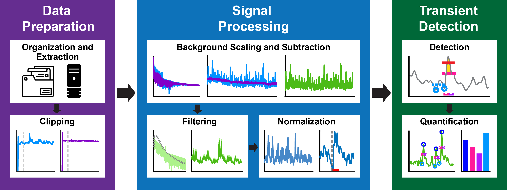

# **PASTa**: **P**hotometry **A**nalysis and **S**ignal Processing **T**oolbox

Welcome to the documentation site for __PASTa__ (**P**hotometry **A**nalysis and **S**ignal Processing **T**oolbox)! The PASTa protocol is an open source toolbox and protocol for the preparation, signal processing, and analysis of fiber photometry data. Fiber photometry is a rapidly growing technique to record real-time neural signaling in awake, behaving subjects. However, the processing and analysis of photometry data streams can be complicated, and there is wide divergence in methods across the field. While several opensource signal processing tools exist, platforms can be inflexible in accommodating experimental designs, lack consistency in peak detection, and be difficult for naive users.

The PASTa protocol is developed to be highly flexible and adaptable to a wide variety of experimental designs. While operating through MATLAB, the code is annotated to be readable, accessible, and adaptable for new users. Here you'll find set up instructions, a detailed user guide, example analyses, and additional details on function inputs and usage. 

PASTa includes flexible and customizable functions for all stages of photometry analysis, from raw data management, data extraction, signal processing, and transient event detection and analysis. The pipeline is designed to process multiple sessions at once, automating data processing and plot creation to ensure application consistency across experimental sessions.

## Navigating the Repository and Documentation
All MATLAB code for the toolbox is available on [GitHub](https://github.com/rdonka/PASTa). This user guide contains detailed documentation, instructions for function use, and troubleshooting tips. 

### Getting Started
The [Getting Started](https://rdonka.github.io/PASTa/gettingstarted/) page includes quick start instructions and installation tips. This is a great place to start if you haven't previously downloaded or implemented the PASTa Protocol on your device.

### User Guide
The [User Guide](https://rdonka.github.io/PASTa/userguide/userguide/) page includes detailed instructions and examples for every step of the protocol, including [Data Preparation](https://rdonka.github.io/PASTa/userguide/datapreparation/), [Signal Processing](https://rdonka.github.io/PASTa/userguide/signalprocessing/), and [Transient Analysis](https://rdonka.github.io/PASTa/userguide/transientanalysis/). This is the best place to start for new users. Each page will walk you through each step, with information about the reccomended settings and any defaults built in to the protocol. The guide also includes examples of each step with fiber photometry recordings with three sensors capturing mesolimbic dopamine dynamics to help users gain an intuition for what each phase of the process is doing to the data streams.

### Function Documentation
For using and troubleshooting individual functions, the [Function Documentation](https://rdonka.github.io/PASTa/functiondocumentation/) page includes even more details about the use of each function in the toolbox, including notes and suggestions for troubleshooting errors. Detailed documentation is also commented in to each function in the source code - just open the function file in MATLAB to read.

### Example Analyses
Additionally, to provide an example of the full pipeline, the [Example Analyses](https://rdonka.github.io/PASTa/exampleanalyses/) page provides users with full examples of experimental analyses. All files needed to perform the example analyses are available for download so users can walk through each step in MATLAB on their own devices to ensure that installation and set up were sucessful, and view outputs of a validated script.

Please feel free to reach out with questions, additional functionality requests, and other thoughts! Our contact information is provided [here](https://rdonka.github.io/PASTa/contactus/).