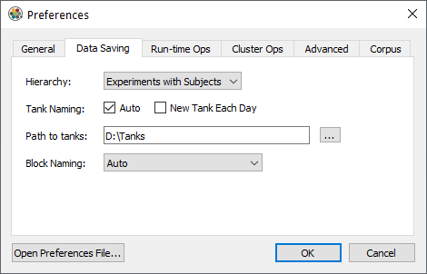
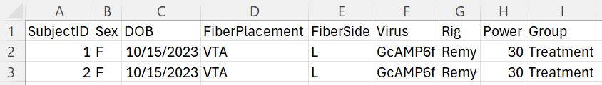
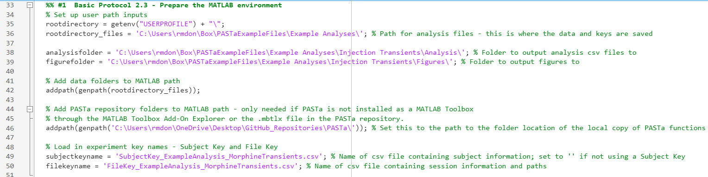
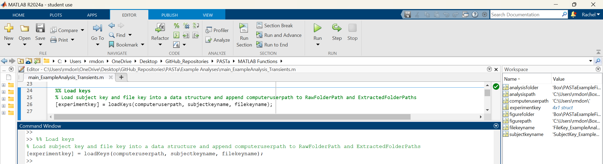
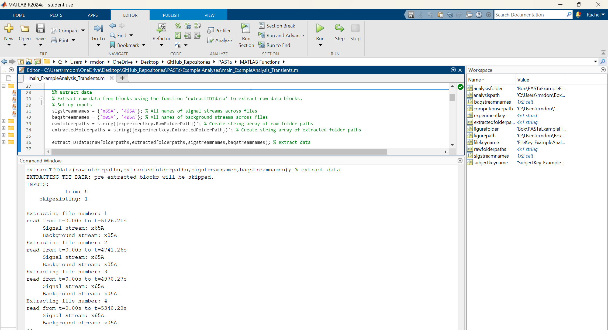
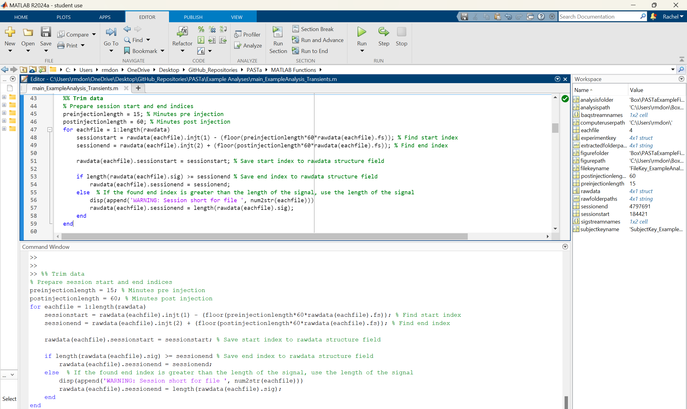
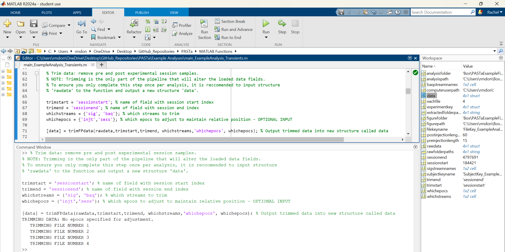

# Data Preparation
The first stage in the PASTa Protocol is data preparation, which involves associating fiber photometry data with experimental meta data, loading raw data, and extracting and saving the raw data as MATLAB data structures to faciliate future analysis sessions. For data collected with Tucker Davis Technologies equipment and software _Synapse_, custom functions are included to extract data from raw formats. 

For data collected with other systems, data must be pre-formatted to match a generic csv file format structure and loaded with provided custom functions, or prepared separately by the user. If your data doesn't match the available load options, please feel free to reach out!

## Data Organization 
The PASTa protocol is set up to accomodate any kind of file organization preferred by the user. Organization preference may vary depending on your lab's file storage practices, photometry equipment, or individual projects.

### TDT Synapse Output
Fiber photometry data collected through the software _Synapse_ (Tucker Davis Technologies) is stored in __tanks__ and __blocks__. __Tanks__ are parent folders created by Synapse for each experiment. __Blocks__ are individual folders for each session containing the actual output data. Stored data cannot be accessed directly via the folder, but rather must be extracted via MATLAB.

By default, the tank path is: C:\TDT\Synapse\Tanks. Synapse recognizes experiments and subjects as key categories of information that play a special role in managing data storage and retrieval. Thus, when running the session, it is critical to ensure the correct Experiment profile is selected, and the correct Subject identifier is input for each session. By default, Synapse names data tanks automatically based on experiment name and the start time of the first recording {ExperimentName}-{yymmdd}-{hhmmss}. Blocks of data are named based on subject {SubjectName}-{yymmdd}-{hhmmss} for each recording session and the start time.

Synapse will save a new Tank for every day unless you change the default setting. Click _Menu_ at the top of the bar, then Preferences. Under the _Data Saving_ tab, make sure "New Tank Each Day" is unchecked.

## Experiment Key Creation
To accomodate a variety of file organization structures, users can first create two csv files containing the information necessary to access raw data, and experimental metadata to match to raw photometry data. MATLAB can access raw data folders stored either locally or in a cloud-based storage app like Box or Dropbox. 

To faciliate analysis, users can create two keys as csv files: a subject key and a file key. In the PASTa protocol, these files will be knit together to pair subject specific information with each individual session of data, preventing the need for manual repeated entry of subject specific information and reduce the time burden of properly maintaining and including experimental metadata factors like subject traits, treatments, and experimental equipment.

First, locate the raw files to be analyzed in your file organization structure. Prepare a folder for extracted raw data to be saved to. This should be separate from your tank folder / raw data storage, and will eventually contain the extracted data sets for each session as MATLAB structures to facilitate efficient data processing in future analysis sessions.

### Subject Key
The subject key should contain information about each subject that is constant and unchanging, such as SubjectID, sex, date of birth, fiber location, sensor, experimental group, and any other user specificed information. 

__For example:__

### File Key
The file key should contain information about each unique session / file to be analyzed. At a minimum, this must include the SubjectID, folder name, raw folder location, and desired location for the raw data to be exported to.

__REQUIRED VARIABLES:__

- __SubjectID:__ Unique identifier of the subject. This fieldname should match the first field in the subject key, and inputs for each subject have to match the subject key for subject specific data to be properly associated to fiber photometry data.

- __Folder:__ The name of the folder containing the raw data.

- __RawFolderPath__: The path to the location where the raw data folder is saved for each specific session. All file paths should be specified in the file key WITHOUT the computer user specific portion of the path. This facilitates analysis across multiple devices or cloud storage solutions without manual edits to the file key. Ensure the specified path ends in a forward slash. __For example__, a file saved to a specific device at the path _"C:\Users\rmdon\Box\RawData\"_ should be specified as  _"Box\RawData\"_.

- __ExtractedFolderPath:__ The path to the location where you would like the extracted data structure to be saved. This should be different than the raw data storage location. All file paths should be specified in the file key WITHOUT the computer and user specific portion of the path. This facilitates analysis across multiple devices or cloud storage solutions without manual edits to the file key. Ensure the specified path ends in a forward slash. __For example__, a file saved to a specific device at the path _"C:\Users\rmdon\Box\ExtractedData\"_ should be specified as  _"Box\ExtractedData\"_.

 Any additional fields can be included such as equipment information, recording power, session condition, drug treatments, body weight, and any other variables that are specific to that one session. Note that the only field name that should overlap with a field name in the subject key is _SubjectID_.
    
__For example:__

### Prepare MATLAB
First, prepare MATLAB by setting up key paths to stored data, locations to save outputs, and add functions folders to the MATLAB path.

__Code example:__

### FUNCTION: _LoadKeys_
_loadKeys_ joins the individual subject information to the file key with the data for each session. Additionally, _loadkeys_ appends the unique computer user portion of the file navigation path to the beginning and the Folder name to the end of the raw and extracted folder paths specified in the file key. This creates the full path to the location of each session's data. __For example,__ _"C:\Users\rmdon\Box\RawData\Subject1-240101-121500"_. The created experiment key should be output into a data structure called _experimentkey_.

__REQUIRED INPUTS:__

- __computeruserpath:__ A string containing the portion of the filepath that is unique to the specific computer being used for analysis. This input allows users to easily switch between computers without updating the individual paths in the file key.

- __subjectkeyname:__ A string containing the name of the csv file that contains the subject key file name, including the _.csv_ extention at the end. If no subject is needed (such as if every subject only has one session of photometry data), then subjectkeyname can be left empty (set to '').

- __filekeyname:__ A string containing the name of the csv file that contains the file key file name, including the _.csv_ extention at the end.

__Code example:__

## Extracting the Data
Prior to beginning analysis, individual session data should be extracted and saved as MATLAB data structures. This makes the process of loading data at the start of each analysis session significantly faster. 

When the raw data is extracted, clipping will be applied by default. This removes the first and last 5 seconds of the session to remove large fluctuations in output signal that occur when the hardware is turned on and off. The number of seconds clipped can be adjusted by overriding the default.

### FUNCTION: _extractdata_

Multiple options are available to extract the data, and should be used depending on the method by which the data was collected, both documented in detail below. Several customized functions are available to extract and format the data for easy processing and analysis. Data collected with TDT can be extracted with custom functions. For all other systems, utilize the generic csv format. 

The required inputs are the same for all extract data functions.

__REQUIRED INPUTS:__

- __rawfolderpaths:__ A string array containing the full paths to the folder locations of raw data to be extracted for each session. This should be formatted as a single column with each full path in a separate row. This is easy to create from the experiment key (see below for an example).

- __extractedfolderpaths:__ A string array containing the full paths to the folder locations where extracted data should be saved for each session (including the individual session name). As with the rawfolderpaths, this should be formatted as a single column with each full path in a separate row and can easily be created from the experiment key (see below for an example).

- __sigstreamnames:__ A cell array containing the strings with the names of all streams to be treated as signal. This allows for flexibility if different photometry rigs have differing naming conventions for the signal stream. Include all signal stream name variations in this cell array. Note that only one stream per file can be treated as signal.

- __baqstreamnames:__ A cell array containing the strings with the names of all streams to be treated as background. This allows for flexibility if different photometry rigs have differing naming conventions for the background stream. Include all background stream name variations in this cell array. Note that only one stream per file can be treated as signal.

- __sigstreamnames:__ A cell array containing the strings with the names of all streams to be treated as signal. This allows for flexibility if different photometry rigs have differing naming conventions for signal stream. Include all signal stream name variations in this cell array. Note that only one stream per file can be treated as signal.

__OPTIONAL INPUTS:__

- __clip:__ Number of seconds to clip at the beginning and end of the session. This defaults to 5 seconds.

- __skipexisting:__ This input allows users to toggle if previously extracted raw data files are re-extracted. By default, previously extracted files will be skipped (skipexisting = 1). To override and re-extract all files, set skipexisting = 0.

Extracted raw data files are saved to the extracted folder path as individual MATLAB structures.

__Code example:__

## Loading the Data
After raw data is extracted, it can be matched to the experimentkey to associate any subject and session metadata with the photometry data. All sessions will be loaded into one data structure (typically called _rawdata_), to ensure that all sessions are analyzed in the same way throughout following steps of the protocol. Each session of data is a row within the data structure.

Regardless of hardware set up, all extracted files can be loaded with the function _LoadKeydata_.

### FUNCTION: _loadKeydata_
__REQUIRED INPUTS:__

- __experimentkey:__ Data structure created by the _LoadKeys_ function, containing at least the field _ExtractedFolderPath_ with the full path to each individual session of data to be loaded.

__Code example:__

## Trimming the Data
The final step in data preparation is optional. Photometry recording may start a few seconds before the experiment begins, such as in cases where users have to initiate hardware for operant boxes separately, and after the experiment ends. Additionally, users may want to remove the first few minutes of each session due to the higher rate of photobleaching before the signal stabilizes. 

If desired, data can be trimmed with the function _trimFPdata_, which uses user derived session start and session end indexes to trim data streams and adjust any event epochs (timestamps) to maintain the relationship in time.

### Index Preparation

If timestamps for session start and end are included in the raw data collection, then these fields can be used as it. If not, users must first determine the appropriate start and end points from whatever timestamps are relevant. For example, in the example analysis provided the session is trimmed to 15 minutes before the first injection time stamp, and 60 minutes after the second injection time stamp.

__Code example of preparing the start and end indices:__

### FUNCTION: _trimFPdata_
__REQUIRED INPUTS:__

- __data:__ Data structure created by the _LoadKeyData_ function. Each session should be a separate row. The data structure must containing at least the fields specified in the additional inputs.

- __whichtrimstart:__ A string containing the name of the field with the locations of the session start indices. Everything before the start index will be trimmed.

- __whichtrimend:__ A string containing the name of the field with the locations of the session end indices. Everything after the end index will be trimmed.

- __whichstreams:__ A cell array containing the field names of all the streams to be trimmed. This should include both the signal and the background streams.

__OPTIONAL INPUTS:__

- __whichepocs:__ A cell array containing the field names of all the epochs (time stamps) to be adjusted. This input can contain as many inputs as the experimental paradigm requires, and each timestamp will be adjusted by subtracting the start index - 1.

__Code example of trimming:__

After data preparation is complete, move to signal processing.