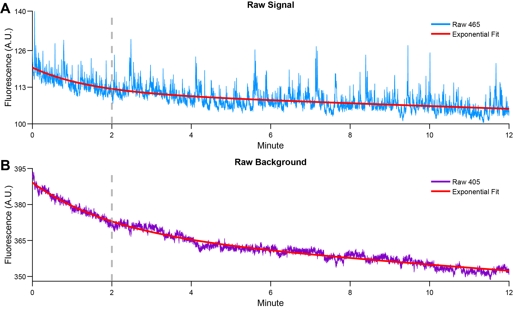

# Data Preparation
The first stage in the PASTa Protocol the organization, extraction, and loading of fiber photometry data and associated metadata into MATLAB prior to signal processing and analysis.

To streamline the analysis workflow, PASTa recommends a standardized data structure that facilitates compatibility and minimizes user error. Organizing data using the subject and file keys allows users to easily merge photometry data with experimental variables across multiple sessions, while reducing manual errors that can occur from repeated copying and pasting. This metadata management approach ensures consistent handling of subject identifiers and experimental conditions, which is essential for batch processing and reproducible analysis. 

To import fiber photometry data into MATLAB, PASTa includes built-in functions to extract data collected with TDT systems or data collected with other systems via a generic csv format option. Pre-extracting photometry signals into individual MATLAB structures greatly reduces processing time across multiple analysis sessions, as the raw data extraction from TDT data blocks or the generic CSV data block format is often the most computationally-intensive step in the workflow.

Preparing and organizing data in this format ahead of analysis ensures smooth integration with PASTa’s functionality and improves overall analysis workflow efficiency. However, if neither extraction option is compatible with user data, users can adapt the existing extraction functions or create their own to accommodate other file structures and import data into MATLAB. The signal processing and transient detection functions are written to be flexible to alternative data structure organizations, providing the required fields are available in the primary data structure.

## Data Organization 
To accommodate a variety of file organization structures, users first create two csv files containing the information necessary to access raw photometry data and the relevant experimental metadata for each subject and recording session. MATLAB can access raw data folders stored either locally or in a cloud-based storage app like Box or Dropbox.

### Prepare Folder Structure
While the functions included in PASTa are written to be flexible and usable with differing data organization practices, we recommend users organize the data for each analysis in a parent folder with subfolders for Raw Data, Extracted Data, Analysis, and Figures. 

Create the project parent folder with the subfolders _"Raw Data"_, _"Extracted Data"_, _"Analysis"_, and _"Figures"_.

The “Raw Data” folder should include subfolders containing the individual fiber photometry session blocks. PASTa currently includes two options for fiber photometry data: 1) Synapse (TDT) Format, and 2) CSV Format.

If your data doesn't match the available load options, please feel free to reach out!

#### Option 1: Synapse (TDT) Format
Fiber photometry data collected through the software _Synapse_ (Tucker Davis Technologies) is stored in __tanks__ and __blocks__. __Tanks__ are parent folders created by Synapse for each experiment. __Blocks__ are individual folders for each session containing the actual output data. Stored data cannot be accessed directly via the folder, but rather must be extracted via MATLAB.

By default, the tank path is: _C:\TDT\Synapse\Tanks_. Synapse recognizes experiments and subjects as key categories of information that play a special role in managing data storage and retrieval. Thus, when running the session, it is critical to ensure the correct Experiment profile is selected, and the correct Subject identifier is input for each session. By default, Synapse names data tanks automatically based on experiment name and the start time of the first recording (e.g., {ExperimentName}-{yymmdd}-{hhmmss}). Blocks of data are named based on subject (e.g., {SubjectName}-{yymmdd}-{hhmmss}) for each recording session and the start time.

Synapse will save a new Tank for every day unless you change the default setting. Click _Menu_ at the top of the bar, then Preferences. Under the _Data Saving_ tab, make sure "New Tank Each Day" is unchecked.

If data are collected with Synapse (Tucker Davis Technologies), raw block folders can be placed directly in the _Raw Data_ folder. Copy the data blocks output by Synapse for each session into _Raw Data_. If blocks are nested in tanks, we recommend to unnest the blocks for ease of file key creation.

#### Option 1a: Synapse (TDT) Format - Multiple Sessions Per Block
Depending on setting configuration, _Synapse_ can also store multiple fiber photometry sessions run simultaneously into one block with sessions identified by the Stores Listing ID for each stream (e.g., 405A and 465A, 405B and 465B). In this case, users can either pre-separate the blocks with TDT's tank manager, or use modified multi block data extraction and load data functions (see below for more details).

#### Option 2: CSV Format
If data are collected with other systems (e.g., Neurophotometics, Doric), users must first format the data files into CSV files.

For each individual recording session, create a folder. The folder name should be unique and include at a minimum the subject ID and recording date (e.g., “Subject001_04032025”). 

Add separate CSV files with the session recording parameters (“recordingparams.csv”), streams (“streams.csv”), and optionally any desired event epochs (“epocs.csv”).

__REQUIRED FILES:__

- __recordingparams.csv:__ A csv file containing fiber photometry recording parameters. Each parameter should be a separate column, with the name of the parameter in the first row and the value in the second row. At a minimum, this must include ‘fs’, containing the sampling rate the data streams were recorded at.

- __sig.csv:__ A csv file containing the signal stream values. Each value should be in a separate row with the first value starting in row 1.

- __baq.csv:__ A csv file containing the background stream values. Each value should be in a separate row with the first value starting in row 1.

__OPTIONAL FILES:__ 

- __Event epoch files:__ Individual csv files containing any desired event or behavioral epochs to be included in the analysis. Each epoch type should be saved as a separate csv file (e.g., ‘epoc_injt.csv’). Each epoch value should be in a separate row with the first value starting in row 1.

_Note: Epochs must be specified as sample number relative to the recorded data streams. Epochs specified as time values must be converted to sample indexes prior to extracting the data._

- __Other relevant data streams:__ Additional csv files with other relevant data streams, such as time indexes of each sample.

After prepared individual session folders are created, copy the blocks to the _Raw Data_ folder in the project parent folder.

### Create the Subject and File Keys
To accomodate a variety of file organization structures, users can first create two csv files containing the information necessary to access raw data, and experimental metadata to match to raw photometry data. MATLAB can access raw data folders stored either locally or in a cloud-based storage app like Box or Dropbox. 

To faciliate analysis, users can create two keys as csv files: a subject key and a file key. In the PASTa protocol, these files will be knit together to pair subject specific information with each individual session of data, preventing the need for manual repeated entry of subject specific information and reduce the time burden of properly maintaining and including experimental metadata factors like subject traits, treatments, and experimental equipment.

The __subject key__ is a csv file with the experimentally relevant subject metadata that is consistent for a subject across all recording sessions (e.g., sex, DOB, implant location, sensor, experimental group, etc). 

The __file key__ is a csv file that lists the names of folders containing data files and the file paths to locate raw data and store extracted data. In the PASTa protocol, the subject key information will be joined to the individual session data to pair subject specific information with each individual recording. The subject key file prevents the need for manual repeated entry of subject specific information, a process that is error-prone. Further, a subject key file reduces the time burden of properly maintaining and including factors like subject traits, treatments, and experimental equipment. At minimum, the subject key must contain the field _“SubjectID”_. Any additional fields can be added as columns in the csv file, and fields can contain any format of data (numeric, string, etc).

#### Create and Save the Subject Key
The subject key should contain information about each subject that is constant and unchanging such as SubjectID, sex, date of birth, fiber location, sensor, experimental group, and any other user specificed information. 

__For example:__

__1.__ Create a .csv file with a column labeled “SubjectID”. Enter the unique SubjectID for each subject included in the experiment.

__2.__ Optional but recommended: Add additional columns for relevant metadata, such as _“Sex”_, _“DOB”_, _“FiberPlacement”_, _“FiberSide”_, _“Sensor”_, _“Group”_, or other experimental variables. These fields will be carried forward into the final data structure and are useful for downstream analyses.

#### Create and Save the File Key
In the file key, each row should correspond to one fiber photometry session. For each session, the key must include at least the SubjectID, path to the raw data block, and path to where the extracted MATLAB structure should be saved. All file paths should be specified in the file key without the specific root directory portion of the path. __For example__, a file saved to a specific device at the path _"C:\Users\rmdon\Box\RawData\"_ should be specified as  _"Box\RawData\"_. This facilitates analysis across multiple devices or cloud storage solutions without manual edits to the file key. Ensure the specified path ends in a forward slash.

__1.__ Create a csv file with the columns “SubjectID”, “BlockFolder”, “RawFolderPath”, and “ExtractedFolderPath”.

__2.__: For each recording session, add a new row to the file:
-  In the _“SubjectID”_ column, enter the corresponding “SubjectID” for the session. Ensure the File Key SubjectIDs match exactly with the IDs used in the Subject Key.

- In the _“BlockFolder”_ column, enter the name of the block folder that contains the raw fiber photometry data for that session.

- In the _“RawFolderPath”_ column, specify the relative path to the parent directory that contains the block folder listed in the _“BlockFolder”_ column. End the path with a forward slash (e.g., '\'). 

- In the _“ExtractedFolderPath”_ column, enter the relative path to the parent directory where the extracted data structure should be saved. This should also end in a forward slash. The extracted data location should be separate from the location of the raw data blocks.  

_Note: All folder paths should be specified in the file key without the system-specific root directory portion of the path. This facilitates analysis across multiple devices or cloud storage solutions without manual edits to the file key. Ensure the specified path ends in a forward slash. For example, for a file where the extracted data structure should be saved to the path "C:\Users\rmdon\Box\ExtractedData\", the ExtractedFolderPath should be specified as "Box\ExtractedData\"._

_Note: For Mac users, all paths should be set using the convention of forward slashes in path directories._

__3.__ Optional but recommended: 
- Include session-specific variables as additional columns in the File Key. These may include information such as equipment used, recording power, session condition, drug treatments or injection volumes, body weight, or other relevant details unique to each recording session. Use field names without spaces or special characters to ensure compatibility with downstream analyses.

_Note: The only field name that should be included in both the Subject Key and File Key is “SubjectID”. Ensure all additional fields have unique and non-duplicated names._
    
__For example:__

## Prepare MATLAB for analysis
Prior to loading and processing fiber photometry data, the MATLAB environment is prepared by adding customized functions and data locations to the MATLAB path and creating helper variables to aid in accessing files. The subject key and file key are joined to create the overall _experimentkey_, which is used to locate, extract, and load fiber photometry data into MATLAB. Prior to beginning analysis, individual session data is extracted and saved as MATLAB data structures. This makes the process of loading data at the start of each analysis session significantly faster.

### Prepare the MATLAB environment

- Define the variable _rootdirectory_ to store the system-specific portion of the file path. This typically corresponds to the user’s home directory or another consistent root location on the local machine (e.g., ‘C:\Users\rmdon\’).

- Add the directories containing the subject key, file key, and PASTa function scripts to the MATLAB search path. This can be done manually through the MATLAB interface or in the main script using the _addpath_ function.

__Code example:__

### Create the Experiment Key
Use the _createExperimentKey_ function to create the _experimentkey_ data structure. This function merges the individual subject information from the subject key with the session information from the file key.  It also appends the rootdirectory and folder names from the field _‘Folder’_ to the _‘RawFolderPath’_ and _‘ExtractedFolderPath’_ fields. This creates the full paths for each session. The _experimentkey_ is output as a MATLAB data structure. 

__REQUIRED INPUTS:__

- __rootdirectory:__ The top level path unique to the user’s system to be appended to _RawFolderPath_ and _ExtractedFolderPath_

- __subjectkeyname:__ The filename of the prepared Subject Key csv file (string; e.g., _‘subjectkey.csv’_). If no subject key is necessary (i.e., the experiment only involves one session per subject), set the _subjectkeyname_ to empty (e.g., ‘’).

- __filekeyname:__ The filename of the prepared File Key csv file (string). 

__OUTPUT:__

- __experimentkey__: A data structure with each row in the file key matched to the subject key, with the full path from root directory to folder name in the _‘RawFolderPath’_ and _‘ExtractedFolderPath’_ fields.

__Code example:__

## Extract fiber photometry data
Extract the fiber photometry data and save the resulting MATLAB structure for each session. One MATLAB structure will be created and saved per session. Saving data in this format facilitates efficient data loading across multiple sessions during downstream analysis. Pre-extracting and saving session-level structures significantly reduces processing time when accessing large datasets or performing batch analyses.

When the raw data is extracted, trimming will be applied by default. By default, this removes the first 5 seconds of the session to remove large fluctuations in output signal that occur when the hardware is turned on and off. The number of seconds trimmed can be adjusted by overriding the default.

__Trimming example.__ First 30 seconds of a fiber photometry recording session (Ventral Tegmental Area (VTA) dopamine activity, GCaMP6f), showing __A)__ the raw signal from the 465nm channel and __B)__ the raw background from the 405nm channel. Both panels illustrate the initial large artifact immediately following the start of the recording. To mitigate undesired effects on signal processing, PASTa by default extracts the data and trims the first 5 seconds of each session.

To extract fiber photometry data and save MATLAB structures for each session, two functions are available depending on the hardware used for data collection. 

### Option 1: Synapse (TDT) Format
For data collected with Synapse (Tucker Davis Technologies) software, use the _extractTDTdata_ function to extract and save a MATLAB structure for each session.

__REQUIRED INPUTS:__

- __rawfolderpaths:__ A string array containing the full path from root directory to folder name for all sessions to be extracted (i.e., the paths contained in the experimentkey field _‘RawFolderPath’_). 

- __extractedfolderpaths:__ A string array containing the full path from root directory to folder name for all sessions to be extracted (e.g., the paths contained in the experimentkey field _‘ExtractedFolderPath’_). 

_Note: the experimentkey can be used to prepare the string arrays of the rawfolderpaths and the extractedfolderpaths. For each array, subset the field in the experimentkey into a cell array and convert the values to strings. See the ‘Example Analysis’ scripts and the code below for an example._

- __sigstreamnames:__ A cell array containing all possible names of the signal stream in the raw data blocks (e.g., {‘465’, ‘x465’}).

- __baqstreamnames:__ A cell array containing all possible names of the background or control stream in the raw data blocks (e.g., {‘405’, ‘x405’}).

__OPTIONAL INPUTS:__

- __‘trim’:__ Specify the number of seconds to trim from the start of the session. By default, the first 5 seconds are trimmed from each stream (see trimming example figure above).

- __‘skipexisting’:__ By default, the function will skip any sessions that already have an extracted MATLAB structure saved to the specified ExtractedFolderPath. To reprocess and overwrite existing structures, set _‘skipexisting’_ to 0.

__OUTPUT:__

- Individual MATLAB structures with extracted data for each session, saved to the location specified by the _extractedfolderpaths_. Each structure includes session date, session time, session length, the sampling rate (fs), fiber photometry signal and background streams (sig and baq), and any event epochs.

_Note: The names of the streams in the raw data blocks are set in the program Synapse. To determine what stream names were set, check the ‘StoresListing.txt’ file in the raw data block folders. Stream names may be stored with an ‘x’ in front of the numbers, and the ‘x’ may not appear in stores listing. As naming conventions may vary by fiber photometry rig, the inputs allow users to include multiple naming conventions. The function will identify which streams exist in the stored data and load the stores into the sig (signal) and baq (background or control) fields respectively._

__Code example:__

### Option 1a: Synapse (TDT) Format - Multiple Sessions Per Block
For data collected with Synapse (Tucker Davis Technologies) software with multiple sessions saved to each block, use the *extractTDTdata_multiblock* function to extract and save a MATLAB structure for each session.

__REQUIRED INPUTS:__

- __experimentkey:__ The full experiment key created by the *createExperimentKey* function, with at minimum the fields:
    - __RawFolderPath__: Field containing the relative path to the parent directory that contains the block folder listed in the _“BlockFolder”_ column. End the path with a forward slash (e.g., '\').
    - __ExtractedFolderPath__: Field containing the relative path to the parent directory where the extracted data structure should be saved. This should also end in a forward slash. The extracted data location should be separate from the location of the raw data blocks. The SubjectID will be appended to this path to ensure unique output files for each session nested within the Block.

- __sigstreamfieldname:__ String; the name of the field in the experiment key containing the name of the signal stream for each session. *Note: these can be identified by looking in the Stores Listing file within each block folder. Be sure to correctly identify the stream name for each session of data nested in the Block.*

- __baqstreamfieldname:__ String; the name of the field in the experiment key containing the name of the background stream for each session. *Note: these can be identified by looking in the Stores Listing file within each block folder. Be sure to correctly identify the stream name for each session of data nested in the Block.*

__OPTIONAL INPUTS:__

- __‘trim’:__ Specify the number of seconds to trim from the start of the session. By default, the first 5 seconds are trimmed from each stream (see trimming example figure above).

- __‘skipexisting’:__ By default, the function will skip any sessions that already have an extracted MATLAB structure saved to the specified ExtractedFolderPath. To reprocess and overwrite existing structures, set _‘skipexisting’_ to 0.

__OUTPUT:__

- Individual MATLAB structures with extracted data for each session, saved to the location specified by the _extractedfolderpaths_ with the SubjectID appended to the end. Each structure includes session date, session time, session length, the sampling rate (fs), fiber photometry signal and background streams (sig and baq), and any event epochs.

_Note: The names of the streams in the raw data blocks are set in the program Synapse. To determine what stream names were set, check the ‘StoresListing.txt’ file in the raw data block folders. Stream names may be loaded into MATLAB with an ‘x’ in front of the numbers, and the ‘x’ may not appear in stores listing. Be sure to align the stream names with the correct Subject for each nested session within the block. The function will identify the specific streams per the experiment key and load the specified stores into the sig (signal) and baq (background or control) fields respectively._

### Option 2: CSV Format
For data collected with other systems (e.g., Neurophotometrics, Doric), use the _extractCSVdata_ function to extract and save a MATLAB structure for each session.

__REQUIRED INPUTS:__

- __rawfolderpaths:__ A string array containing the full path from root directory to folder name for all sessions to be extracted (i.e., the paths contained in the experimentkey field _‘RawFolderPath’_). 

- __extractedfolderpaths:__ A string array containing the full path from root directory to folder name for all sessions to be extracted (e.g., the paths contained in the experimentkey field _‘ExtractedFolderPath’_). 

_Note: the experimentkey can be used to prepare the string arrays of the rawfolderpaths and the extractedfolderpaths. For each array, subset the field in the experimentkey into a cell array and convert the values to strings. See the ‘Example Analysis’ scripts and the code below for an example._

- __sigstreamname:__ A string containing the name of csv file of the signal stream in the raw data block folders (e.g., ‘465’).

- __baqstreamname:__ A string containing the name of csv file of the background or control stream stream in the raw data block folders  (e.g., ‘405’).

__OPTIONAL INPUTS:__

- __'loadepocs’:__ Set to 1 to load files containing event epochs.

- __‘epocsnames’:__ A cell array containing all names of the csv files in the raw data block folders containing event epochs to be extracted and added to the data structure (e.g., {‘injt’, ‘strt’}).

- __‘trim’:__ Specify the number of seconds to trim from the start of the session. By default, the first 5 seconds are trimmed from each stream (see trimming example figure above).

- __‘skipexisting’:__ By default, the function will skip any sessions that already have an extracted MATLAB structure saved to the specified ExtractedFolderPath. To reprocess and overwrite existing structures, set _‘skipexisting’_ to 0.

__OUTPUT:__

- Individual MATLAB structures with extracted data for each session, saved to the location specified by the _extractedfolderpaths_. Each structure includes session date, session time, session length, the sampling rate (fs), fiber photometry signal and background streams (sig and baq), and any event epochs.

__Code example:__

## Load Fiber Photometry Data
To facilitate the processing of fiber photometry data and transient event detection, the PASTa protocol utilizes MATLAB data structures to organize the inputs and outputs to and from PASTa functions. The prepared data structure should contain each fiber photometry recording session as a row, with all subject and session specific metadata in addition to fiber photometry data streams, sampling rate, and event epochs.

### Load data into a MATLAB structure
Use the _loadKeydata_ function to load the extracted fiber photometry data for all sessions in the _experimentkey_. This function matches each session in the experiment key to its corresponding extracted MATLAB structure and appends fiber photometry data fields. Regardless of hardware set up and which data extraction function is used, all extracted files can be loaded with the function _loadKeydata_.

__REQUIRED INPUTS:__

- __experimentkey:__ The _experimentkey_ object created by the _createExperimentKey_ function.

__Output:__

- __data:__ The combined data structure containing all fields in the experiment key appended with the extracted fiber photometry data for each session. All subject and session specific metadata are included alongside the fiber photometry data for streamlined analysis.

_Note: If desired, users can create and use their own pipeline to organize and load fiber photometry data into MATLAB. To be compatible with PASTa functions, the data preparation process should result in a MATLAB data structure with each fiber photometry session as a row with fields containing at least a SubjectID variable, the photometry signal stream (e.g., 465nm stream), and the photometry control or background stream (e.g., 405nm stream)._

__Code example:__

#### Load data into a MATLAB structure - Multiblock Format
If TDT data is stored in the multi block format, with multiple sessions of recording nested within each block, use the *loadKeydata_multiblock* function to load the extracted fiber photometry data for all sessions in the _experimentkey_. This function matches each session in the experiment key to its corresponding extracted MATLAB structure and appends fiber photometry data fields.

__REQUIRED INPUTS:__

- __experimentkey:__ The _experimentkey_ object created by the _createExperimentKey_ function. *Note: The SubjectID from the experiment key will be appended to the extracted folder path to properly load each extracted session into MATLAB.

__Output:__

- __data:__ The combined data structure containing all fields in the experiment key appended with the extracted fiber photometry data for each session. All subject and session specific metadata are included alongside the fiber photometry data for streamlined analysis.

### Optional: Crop fiber photometry data
In cases where fiber photometry recordings begin or end outside the experimentally relevant period – for example, when hardware is manually triggered before or after the behavioral task begins or ends – users may wish to crop the data streams to remove the beginning and end of each session. Additionally, users may wish to exclude the initial portion of the recording session (e.g., the first few minutes), where photobleaching is typically more pronounced and nonlinear before signal stabilization.

__Crop data example:__ Fiber photometry (VTA dopamine activity, GCaMP6f) raw __A)__ signal (465nm) and __B)__ background (405nm) data streams each fit with an exponential decay function (red). Both streams show a steeper decay slope in the first two minutes, reflecting an initially faster rate of photobleaching that stabilizes over time. To account for this, the PASTa protocol recommends cropping the data streams to exclude the first two minutes of each session prior to further analysis.

If cropping is desired, users must first prepare the start and end indexes of the range of the data streams to be included. Any samples outside the start and stop indexes will be remove. If event epochs are included in the analysis, users should specify an optional input to adjust the epochs by the crop start index to maintain spatial aligned with data streams.

__1.__ Prepare session start and end indexes. Add fields to the data structure specifying the desired session start and end sample indexes for each session. Ensure these values are integers. 

_Note: Start and end points can typically be calculated using time and sampling rate or can be anchored to a known event epoch such as the start of a behavioral paradigm. Examples of start and end index calculation are included in the Example Analysis files._

__Code example:__

__2.__ Use the _cropFPdata_ function to crop fiber photometry streams based on user-defined session start and end sample indexes. This function also adjusts event epochs to maintain correct temporal alignment. 

__REQUIRED INPUTS:__

- __data:__ Data structure created by the _LoadKeyData_ function. Each session should be a separate row. The data structure must containing at least the fields specified in the additional inputs.

__REQUIRED INPUTS:__

- __data:__ The full data structure containing all session data.

- __cropstartfieldname:__ The name (string) of the field in the data structure containing the prepared start indexes for cropping (e.g., ‘sessionstart’).

- __cropendfieldname:__ A string containing the name of the field with the locations of the session end indices. Everything after the end index will be cropped.

- __streamfieldnames:__ A cell array containing the names of the streams to be cropped. Typically, this includes the fields containing the signal and background streams (e.g., {‘sig’, ‘baq’}).

__OPTIONAL INPUTS:__

- __'epocsfieldnames':__ A cell array containing the names of all event epoch fields that should be adjusted in accordance with the cropping. Epoch fields should contain timestamps in sample number for each event. Each timestamp will be offset by the number of samples removed at the start of the session. Any number of event fields can be adjusted depending on the needs of the experimental paradigm (e.g., {‘strt’, ‘injt’}).

__OUTPUT:__

- __data:__ The data structure with the specified fields cropped and any input epochs adjusted to maintain alignment.

_Note: The cropFPdata function directly modifies the fields in the input MATLAB data structure by overwriting the specific fiber photometry streams and any event epochs selected for adjusted. To maintain data integrity and traceability, consider loading the original fiber photometry data into a separate structure (e.g., rawdata) and saving the cropped output to a new structure (e.g., data). This approach helps preserve the unaltered data and prevent accidental double cropping during analysis._

__Code example of cropping:__

After data preparation is complete, continue to [Signal Processing](https://rdonka.github.io/PASTaUserGuide/userguide/signalprocessing/).