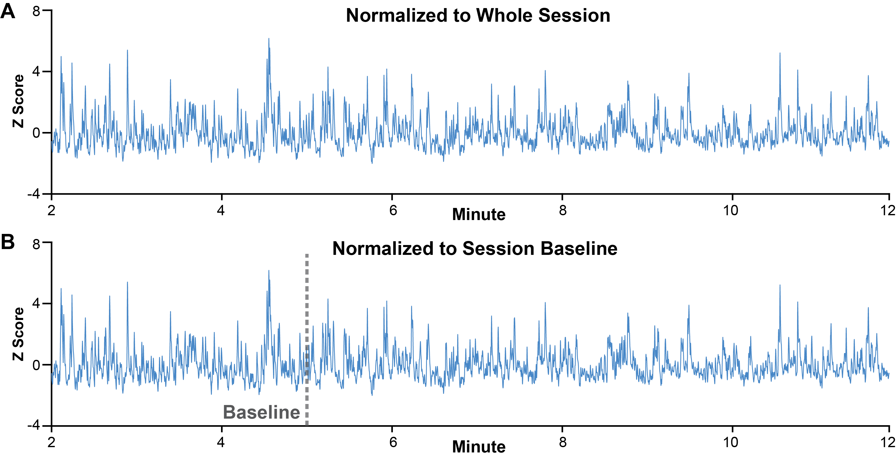
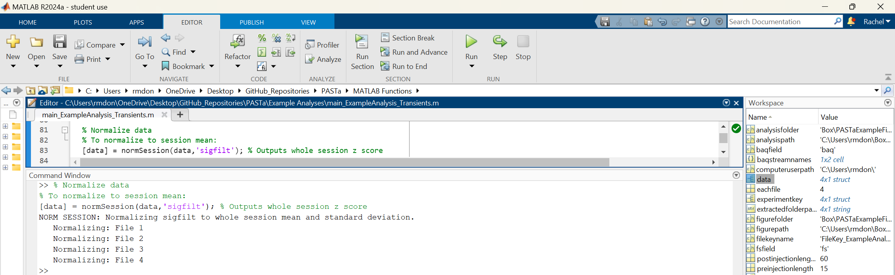
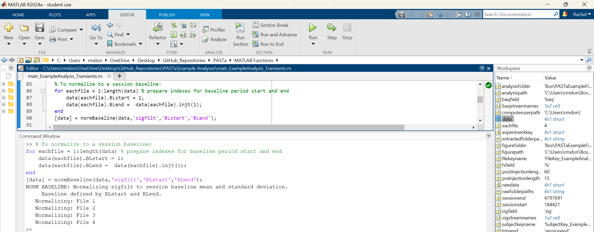

# Signal Processing
After raw photometry data is loaded in to MATLAB, signal processing is conducted to account for photobleaching, motion artifacts, and other sources of "noise". The signal processing functions are written to be as flexible to differing streams and naming conventions as possible, but if the functions don't match your data, please reach out and let us know and we will update.

## Background Scaling, Subtraction, and Filtering
To correct for photobleaching and motion artifact, the background is scaled to the signal stream and subtracted. While previous tools and packages have used regression based approaches, PASTa scales the background based on the frequency domain of the streams, preventing over or underfitting and maintaining the shape of the background. 

### Background Scaling and Subtraction
To determine the scaling factor for the background stream relative to the signal stream, both the signal and background streams are converted to the frequency domain via Fast Fourier Transform (FFT). The scaling factor is calculated as for all frequencies greater than 10 Hz. The background stream is scaled in the time domain; the background is centered around zero, multiplied by the scaling factor, and then adjusted to center around the signal mean.

The scaled background is subtracted from the raw signal in the time domain. Subtracted signal is output as dF/F, where dF/F = (Signal - Scaled Background) / Scaled Background. If desired, users can override the default to output the as dF instead (dF = Signal - Scaled Background).

Users have the ability to override PASTa protocol defaults to modify parameters including the scaling threshold frequency cutoff, subtracted data output, or select an alternative method of background scaling.

### Examples of Background Scaling and Subtraction with VTA GCaMP6f, NAcLS dLight1.3b, and NAcLS GRABDA2H

__Figure 2:__ Background scaling and subtraction examples for VTA GCaMP6f, NAcLS dLight1.3b, and NAcLS GRABDA2H. __A)__ Traces of 465nm (signal) and 405nm (background) raw streams. __B)__ Magnitude frequency plots of the Fast Fourier Transform (FFT) of raw, overlaid raw, and overlaid raw 465 and scaled 405nm streams. __C)__ Trace of raw 465nm stream with overlaid scaled 405nm stream. __D)__ Subtracted signal output as dF/F. Overall, frequency background scaling aligns the background with the signal, preventing over or under scaling while preserving the shape of both signal streams.

### Alternative Background Scaling Methods
In our hands, frequency scaling performs better than other scaling approaches. Advantages are particularly notable for sensors such as GRABDA2H, for which 405nm is not a perfect isosbestic control. Use of frequency scaling rescues the use of the 405nm stream to control for photobleaching and motion artifact. This may be particularly useful as new sensors are continually in development, not all of which have an isosbestic or commercially available control wavelength for use in photometry systems.

However, users may want to use or compare to other commonly used methods of scaling the background to the signal. The PASTa toolbox subtraction function includes options to use OLS regression, detrending and OLS regression, Lowess Smoothing and OLS Regression, and IRLS regression to scale the background prior to subtraction.

### Comparison of Scaling Methods with VTA GCaMP6f, NAcLS dLight1.3b, and NAcLS GRABDA2H

__Figure 3:__ Background scaling, subtraction examples and magnitude frequency plots for VTA GCaMP6f, NAcLS dLight1.3b, and NAcLS GRABDA2H with differing background scaling methods. __A) Frequency Scaling:__ PASTa Protocol default method; The raw background is scaled to the signal based on a constant scaling factor determined by the ratio of the background to the signal in the frequency domain for frequencies greater than 10 Hz. __B) OLS Regression Scaling:__ Commonly used method where the raw background is scaled to the signal with ordinary least squares regression, using the model fit to generate the scaled background stream. __C) Linear Detrend and OLS Regression:__ Prior to scaling, both the raw signal and the raw background streams are detrended to remove the linear component of the stream (this is usually the decay of the signal over time). Ordinary least squares regression is then used with the detrended signals to generate the scaled background stream. __D) Lowess Smoothing and OLS Regression:__ Prior to scaling, both the raw signal and the raw background streams are smoothed via Lowess smoothing. Ordinary least squares regression is then used with the smoothed signals to generate the scaled background stream. __E) IRLS Regression:__ Relatively newer method where waw background is scaled to the signal with iteratively reweighted least squares regression to generate the scaled background stream.

__Figure 4:__ Samples of scaled background and subtracted signal across scaling methods and sensors. Overall,
correlations indicate that while most methods are similar for GCaMP6f and dLight1.3b, for GRABDA2H frequency
scaling preserves the shape of the background and prevents underscaling relative to other methods.

### Filtering
After subtraction, the signal is filtered to remove high frequency noise and facilitate further analysis. The PASTa Protocol defaults to applying a 3rd order bandpass Butterworth filter with a high pass cutoff of 0.0051 Hz to remove the zero frequency DC component of the signal and a low pass cutoff of 2.286 Hz to remove high frequency components outside the typical band of interest for photometry sensors.

__Figure 5:__ Examples of subtracted and filtered data for for VTA GCaMP6f, NAcLS dLight1.3b, and NAcLS GRABDA2H. __A)__ Magnitude frequency plots of the Fast Fourier Transform (FFT) of the subtracted and filtered streams. Note that the Butterworth bandpass filter is overlaid (grey dashed line) on the pre-filtering subtracted stream magnitude frequency plots. __B)__ Trace of the subtracted stream (signal - scaled background). __C)__ Trace of the subtracted and filtered stream. __D)__ Zoomed in overlaid example of the subtracted and filtered streams. Note that the filtered stream is in the darker shade.

While the PASTa Protocol has default filter settings, users can override these as required by sensor or experimental design to modify the filter type (band-pass, high-pass, low-pass), order, and cutoff frequencies.

### _Function:_ subtractFPdata
Subtracts the specified background channel from the specified signal channel and applies a Butterworth filter. Outputs data as dF/F (default) or dF.

__REQUIRED INPUTS:__

- __data:__ Data structure created by the _LoadKeyData_ function. Each session should be a separate row. The data structure must containing at least the fields specified in the additional inputs.

- __whichsigfield:__ A string with the name of the field containing the signal stream. For example, 'sig'.

- __whichbaqfield:__ A string with the name of the field containing the signal stream. For example, 'baq'.

- __whichfs:__ A string with the name of the field containing the sampling rate of the streams. For example, 'fs'.

__OPTIONAL INPUTS:__

- __baqscalingtype:__ A string that specifics the type of background scaling to apply. Default: 'frequency'.
    - _'frequency':_ Scales the background to the signal channel based on ratio of specified frequency bands in the FFT of the channels
    - _'sigmean':_ Scales the background to the signal channel based on the ratio of the mean of the signal to the mean of the background.
    - _'OLS':_ Uses ordinary least-squares regression to generate scaled background.
    - _'detrendedOLS':_ Removes the linear trend from signal and background streams prior to using ordinary least-squares regression to generate scaled background.
    - _'smoothedOLS':_ Applies lowess smoothing to the signal and background streams prior to using ordinary least-squares regression to generate scaled background.
    - _'IRLS':_ Uses iteratively reweighted least squares regression to generate scaled background.

- __baqscalingfreq:__ Only used with 'frequency' baqscaling. An integer to specify the frequency (Hz) threshold for scaling the background to signal channel. Frequencies above this value will be included in the scaling factor determination. Default: 10

- __baqscalingperc:__ Only used with 'frequency' and 'sigmean' baqscaling. Adjusts the background scaling factor to be a percent of the derived scaling factor value. Input should be between 0 and 1. Default: 1 (100%)

- __subtractionoutput:__ A string specifying the output type for the subtracted data. Default: 'dff'
    - _'dff':_ Subtracted signal is output as delta F/F. dF/F = (Signal - Scaled Background) / Scaled Background
    - _'df':_ Subtracted signal is output as delta F. dF = Signal - Scaled Background

- __filtertype:__ A string that specifies the type of filter to be applied to the subtracted data stream. Default: 'bandpass'
    - _'nofilter':_ No filter will be applied.
    - _'bandpass':_ A bandpass filter will be applied.
    - _'highpass':_ Only the high pass filter will be applied. 
    - _'lowpass':_  Only the low pass filter will be applied.

- __padding:__ Set to 1 (default) to apply padding. Padding takes the specific percent of the start of the stream, flips it, and appends it to the data before filtering. Appended data is trimmed after filtration. The prevents issues that can occur with filtering the start of any data stream due to the incomplete initial window. Set to 0 to turn off padding. Default: 1

- __paddingperc:__ Percent of data length to use to determine the number of samples to be appended to the beginning and end of data in padding. Set to minimum 10%. Input should range from 0 to 1. Default: 0.1 (10%)

- __filterorder:__ The order to be used for the Butterworth filter. Default: 3

- __highpasscutoff:__ The cutoff frequency (Hz) to be used for the high pass Butterworth filter. Default: 2.2860.

- __lowpasscutoff:__ The cutoff frequency (Hz) to be used for the low pass Butterworth filter. Default: 0.0051.

- __supressdisp:__ If set to anything other than 0, this will suppress the command window displays. Default: 0

__OUTPUTS:__

- __data:__ The original data structure with added fields with the function inputs, scaled background (baq_scaled), subtracted signal (sigsub), and subtracted and filtered signal (sigfilt).

__Code example:__ Subtraction with default scaling and filter parameters

__Code example:__ Subtraction with background scaling type set to OLS Regression and filter type set to highpass only.

## Normalization
Normalization converts the filtered signal to Z score. Multiple methods are included in the tool box to accomodate a variety of experimental designs.

Whole session normalization uses the mean and SD of the whole session. Session baseline uses the mean and SD from a specified session baseline, which may be useful in cases where a drug is delivered mid session, experimental events occur mid session, or other treatments may result in a sustained shift that could bias signal normalization. Data can also be normalized on an individual trial basis to a local pre-trial baseline - see the _Trial Analysis_ section of the user guide.

__Figure 5:__ Normalization examples. __A)__ Normalization (Z Score) to whole session mean and SD. __B)__  Normalization (Z Score) to a 3-min session baseline mean and SD.

### _Function:_ normSession
Normalizes the data stream to Z Score based on the whole session mean and SD.

__REQUIRED INPUTS:__

- __data:__ Data structure containing at least the stream to be normalized. Each session should be a separate row.

- __whichstream:__ A string with the name of the field containing the stream to be normalized. For example, 'sigfilt'.

__OUTPUTS:__

- __data:__ The original data structure with the added fields 'data.WHICHSTREAMz_normsession' containing the whole session normalized stream.

__Code example:__

### _Function:_ normBaseline
Normalizes the whole session data stream to Z Score based on a baseline period.

__REQUIRED INPUTS:__

- __data:__ Data structure containing at least the stream to be normalized, a field with the baseline start index, and a field with the baseline end index. Each session should be a separate row.

- __whichstream:__ A string with the name of the field containing the stream to be normalized. For example, 'sigfilt'.

- __whichblstart:__ A string with the name of the field containing the index of the start of the baseline period. This field must be prepared before using the normBaseline function.

- __whichblend:__ A string with the name of the field containing the index of the end of the baseline period. This field must be prepared before using the normBaseline function.

__OUTPUTS:__

- __data:__ The original data structure with the added fields 'data.WHICHSTREAMz_normsession' containing the whole session normalized stream.

__Code example:__

Differing normalization methods may be advantageous depending on the experimental design. If additional options are required, please let us know!

