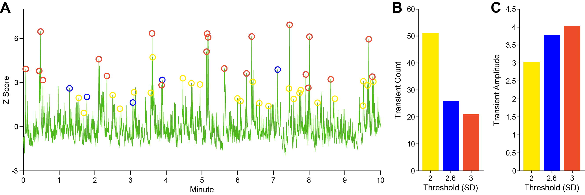
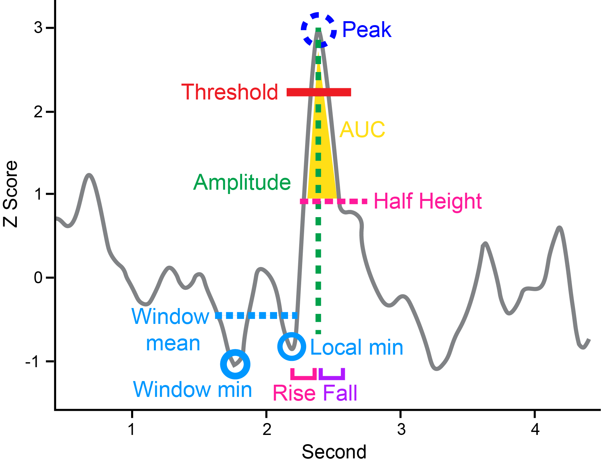
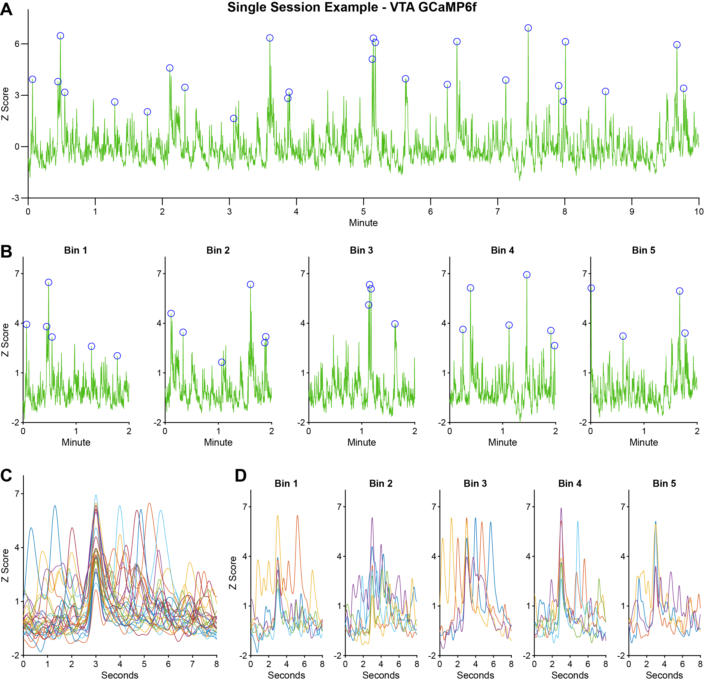

# Transient Detection and Quantification
Transient event analysis is a widely used method for quantifying rapid, phasic changes in neural activity or neuromodulator release, and is a central analytic approach not only in fiber photometry but also in other techniques such as fast-scan cyclic voltammetry and electrophysiology [15, 30]. In fiber photometry, transients are interpreted as population-level bursts of neural activity or neurotransmitter fluctuations and can be characterized by their frequency, amplitude, duration, temporal alignment with behavioral or experimental events, and their occurrence patterns over time within a session. Given the diversity of measured characteristics and abundance of data per photometry recording, identifying changes in transient shape and occurrence is optimal for detecting treatment effects, internal state transitions, or gradual changes in neural dynamics.

PASTa implements a flexible and robust framework for transient detection, designed to accommodate a wide range of experimental designs and sensor types. Previous tools and packages have used a sliding window approach, where all values above an absolute threshold are counted as peaks. Here, we present a method of peak detection where each peak is compared to a local baseline and amplitude is calculated and compared to a threshold to determine inclusion. This allows for consistent parameters across the session and reliable detection of individual events despite signal absolute value fluctuation. 

The core detection algorithm first identifies local peaks in the signal. For each peak, a pre-peak baseline is estimated, and the event amplitude is calculated as the difference between the peak and this baseline. The amplitude is then compared to a user-defined threshold to determine inclusion. This method is advantageous over simpler prominence or absolute value criteria as it accounts for local fluctuations in baseline, which can shift over time. In contrast, fixed-amplitude or prominence methods can be overly sensitive to slow drifts in the signal, potentially underestimating events during high-variability periods or overestimating events when variability is low [24].

## Threshold Setting
To detect transient events, PASTa first identifies all peaks in the data stream, finds the pre-peak baseline for each peak to calculate peak amplitude, and then compares the amplitude to the specified threshold for inclusion. Transients are detected as peaks with a greater amplitude than the specified threshold.

### Threshold Considerations
We recommend users set the transient detection threshold at 2.6 standard deviations (SDs), which reflects a high-confidence p-value (< .01) [24] . This threshold is conservative, only detecting spontaneous events that significantly stand out from the fluctuation of the signal. Setting the threshold lower will result in detection of greater number of events with smaller amplitudes, while setting thresholds higher will result in detection of fewer events with greater amplitudes (see Fig. 7 for a comparison across thresholds). 

Determining the threshold for transient inclusion is critical to ensure that effects are accurately characterized. Thresholds should be set with consideration of the experimental paradigm. Certain pharmacological treatments may affect the frequency and amplitude of transients, therefore treated vs control recordings may produce vastly different whole session mean and SDs. In these cases, we recommend for users to define thresholds based on subsections of the recording session (e.g., baseline or intertrial interval periods).

Similarly, the normalization method will affect which transients are included. Specific normalization methods can compress transient height (e.g., with systemic drug injection or stimulation recordings normalized to whole session mean and SD), making it harder for events to reach threshold compared to control treatments [24]. In these cases, normalizing to a baseline or detecting transients in F/F may be preferable.

__Transient threshold comparison.__ Comparison of transient detection with amplitude thresholds of 2, 2.6, and SDs from a single VTA dopamine GCaMP6f recording session. The subtracted and filtered data stream was Z-scored to the whole session mean and SD prior to transient detection. Note that each lower threshold includes the events detected by the higher thresholds (e.g., 2 SD includes the events detected by both 2.6 and 3 SD thresholds). __A)__ Normalized trace plot showing detected transients for each threshold. __B)__ Whole session transient count at each threshold. __C)__ Mean transient amplitude (Z-score) at each threshold.

### Prepare Thresholds
Prior to detecting session transients, users must prepare the thresholds to be used for event detection for each recording session. If the processed signal used for transient analysis is normalized to a Z-score, thresholds can be set in standard deviation units. If the processed signal used for transient analysis is in ΔF or ΔF/F, thresholds must be calculated for each session based on the standard deviation of the stream.

Users must add a field to the data structure with the desired transient amplitude thresholds for each recording session.

#### Option 1: Normalized (Z-Score) Data Streams
For Z-scored data, set the threshold in SD units. We recommend a threshold of 2.6 SDs.

#### Option 2: Non-Normalized (ΔF or ΔF/F) Data Streams
Calculate the equivalent of 2.6 SDs (or other chosen threshold) in the units of the stream to be used for transient detection and quantification. For example, if using ΔF/F, calculate the SD of the ΔF/F stream and multiply it by 2.6.

__Code example:__ 

## Detect and Quantify Transients
Transient detection relies on the comparison of the maximum value of each peak in the data stream to a local baseline to determine amplitude. PASTa includes three options for transient baselines: baseline minimum, baseline mean, or local minimum.

For all transient detection functions, event baseline is determined by a specified window before the peak maximum location. By default, the window spans 800ms to 100ms before the peak maximum. The baseline minimum function uses the minimum value in the window as the pre-peak baseline, while the baseline mean function uses the mean of the window. The local minimum option uses the last local minimum in the baseline window as the pre-peak baseline. Peak amplitude is calculated as the maximum peak value minus the baseline value. For each peak, the amplitude is compared to the specified threshold to determine inclusion.

Transients that pass the amplitude threshold are then quantified for further analyses of transient dynamics (see figure below). For each transient event, the output includes the maximum peak index, maximum peak value, pre-peak baseline index (center of the window if using the baseline mean function), pre-peak baseline value, and peak amplitude (max peak – baseline). To more finely characterize events, temporal variables for each event are determined at half height by default. Users can adjust the specified quantification height if desired. The rise phase of each transient event is characterized by the rise start index, number of samples from rise start to maximum peak, and millisecond duration of the rise period. To characterize the fall period, the function identifies the first index within 2000 milliseconds after the peak maximum that is equal to the quantification height value; however, the post peak fall window length can be adjusted if desired. The fall phase of each event is then quantified by the fall end index, number of samples from peak maximum to fall end, and millisecond duration of the fall period. To combine rise and fall dynamics, the whole transient width in samples and milliseconds are included, as well as total area under the curve (AUC).

To enable analysis of transient event dynamics, the interevent interval between each transient is included in both samples and milliseconds. Finally, transients are identified as compound events if the maximum peak location falls within +/- 2000 milliseconds of another transient event. The window for compound event identification can be adjusted if desired. 

Default parameters for baseline window size, post peak maximum fall window, quantification height, compound event window size are included but users can override defaults if desired to customize the transient analysis.

__Transient detection and quantification example.__ All peaks (dark blue) in the data stream are identified and compared to a baseline (light blue), which can be determined by a pre-peak window mean (default), pre-peak window minimum, or the pre-peak local minimum. Amplitude (green) is calculated as the difference between the maximum peak value and the baseline, and events with amplitudes greater than the set threshold (red) are included. Transient events are quantified by amplitude (green), rise duration from half-height (pink), fall duration from half-height (purple), and half-height area under the curve (yellow).

### Find Transients
Use the _findTransients_ function to detect and quantify transient events in the desired data stream.

__REQUIRED INPUTS:__ When calling the _findTransients_ function, specify:

- __data:__ The full data structure containing all session data. The data structure must include (at a minimum) fields with the stream to be analyzed for transient events, the sampling rate of the data stream, and the user determined transient threshold.

- __addvariablesfieldnames__: A cell array containing the field names of all subject metadata variables from the main data structure to add to the transient data output. For example, Subject ID, block folder name, treatment group, treatment condition, or any other experimentally relevant variables, as well as the params field with the parameters used by all other functions in the pipeline.

- __streamfieldname:__ The name of the field containing the full stream to be analyzed for transient events (typically the subtracted and filtered data stream 'sigfilt' or the normalized subtracted and filtered data stream such as 'sigfiltz_normSession').

- __thresholdfieldname:__ The name of the field containing the amplitude threshold for transient inclusion. Be sure to specify the threshold in the same units as the specified stream in _streamfieldname_.

- __fsfieldname:__The name of the field containing the sampling rate of the stream (typically 'fs').

__OPTIONAL INPUTS:__

- __'bltype':__Specify the pre-transient baseline method. Available options are: 
    - __'blmean' (default):__ Pre-peak baselines are set to the mean value of the baseline window.
    - __'blmin':__ Pre-peak baselines are set to the minimum value in the baseline window.
    - __'localmin':__ Pre-peak baselines are set to the last local minimum value in the baseline window.

- Adjust baseline window size. By default, the baseline window is set to 1000ms to 100ms preceding the peak maximum. Users can adjust the baseline window by specifying number of milliseconds preceding the peak maximum to start and end the baseline window.
    - __'blstartms':__ Set to the desired milliseconds pre-peak to adjust the start of the baseline window.
    - __'blendms':__ Set to the desired milliseconds pre-peak to adjust the end of the baseline window.

- __'posttransientms':__ Adjust the post-transient fall window size in milliseconds. By default, the post-transient window to search for the fall index and value is set to 2000 ms. 

- __'quantificationheight':__ Set the quantification height at which to determine the rise, fall, and area variables for each transient. By default, transient temporal dynamics are quantified at half height (0.5). Note that the input must fall between 0 and 1.

- Adjust the output of cut transient event data streams. By default, _findTransients_ will output a table with the cut data streams from 5 seconds before the peak to 8 seconds after the peak for each transient to allow for plotting and additional analysis. Set optional inputs:
    - __'outputtransientdata':__ Set to 0 to skip the output of cut transient data streams.

    - __'outputpremaxS':__ Set to desired number of seconds pre-transient peak to include in the cut data streams. Default: 5.

    - __'outputpostmaxS':__ Set to desired number of seconds post-transient peak to include in the cut data streams. Default: 8.

__OUTPUT:__

_findTransients_ returns the separate data structure transientdata with each session as a row including the variables specified in _addvariablesfieldnames_, all parameters used in the analysis (_params_), the tables of quantified transient events (_transientquantification_), and the cut transient event data stream relative indexes (_transientstreamlocs) and data (transientstreamdata_).

__Code example:__ Whole session transient detection with baseline minimum and default inputs.

__Code example:__ Whole session transient detection with baseline mean and shortened pre-peak baseline window.

__Code example:__ Whole session transient detection with local minimum and 25% quantification height.

#### Transient Quantification Variables
PASTa outputs multiple features for each transient event that can be quantitatively analyzed and compared. The function _findTransients_ automatically calculate numerous variables for each transient to characterize amplitude and event duration. The following variables are included for each transient event in the _transientquantification_ table: 

* __maxloc:__ The index (sample number) of the max peak location

* __maxval:__ The stream value of the max peak location. _Note: this variable is in the units of the data stream used to detect transient events_

* __blstartloc:__ The index (sample number) of the start of the pre-peak baseline window

* __blendloc:__ The index (sample number) of the end of the pre-peak baseline window

* __blloc:__ The index of the baseline value. _Note: if the baseline mean ('blmean') option is used, this reflects the middle of the baseline window. If the baseline minimum ('blmin') or local minimum ('localmin') options are used, this will be the exact index of the identified baseline point

* __blval:__ The value of the pre-peak baseline. _Note: this variable is in the units of the data stream used to detect transient events_

* __amp:__ The amplitude of the event from the pre-peak baseline to the max peak (maxval - blval). _Note: the amplitude of all events will be at least the value of the set threshold (reccomended 2.6 SDs)_

* __quantheightval:__ The value of the point corresponding to the quantification height (default half-height). _Note: this variable is in the units of the data stream used to detect transient events_

* __risestartloc:__ The index (sample number) of the start of the rise phase, measured from the peak to quantification height (default half height)

* __risesamples:__ The number of samples between the start of the rise phase to the transient peak (maxloc - risestartloc)

* __risems:__ The number of milliseconds from the start of the rise phase to the transient peak (risesamples / fs (sampling rate in Hz))

* __fallendloc:__ The index (sample number) of the end of the fall phase, measured from the peak to quantification height (default half height)

* __fallsamples:__ The number of samples between the transient peak and the end of the fall phase (fallendloc - maxlox)

* __fallms:__ The number of milliseconds from the transient peak to the end of the fall phase (fallsamples / fs (sampling rate in Hz))

* __widthsamples:__ The number of samples between the start of the rise phase and the end of the fall phase (fallendloc - risestartloc)

* __widthms:__ The number of milliseconds from the start of the rise phase and the end of the fall phase (widthsamples / fs (sampling rate in Hz))

* __AUC:__ The total area under the curve from the start of the rise phase to the end of the fall phase (determined using the trapezoidal method)

* __IEIsamples:__ The total number of samples from the peak of the previous event to the peak of the current event (current event maxloc - previous event max loc)

* __IEIms:__ The number of milliseconds between the peak of the previous event and the peak of the current event (IEIsamples / fs (sampling rate in Hz))

* __IEIs:__ The number of seconds between the peak of the previous event and the peak of the current event (IEIsamples / fs (sampling rate in Hz) / 60)

* __compoundeventnum:__ If events occur within the compound event window, this variable will include an ID starting at 1 for each event within the window. If no other events occur within the compound event window, this will be set to 0.

__Output Example - Adding Transients to the Data Structure:__ Output of findSessionTransients, which is a sub-structure under the field _sessiontransients_ added to the main data structure.

__Output Example - Function Inputs:__ Inputs passed to the findSessionTransients functions are output to the table _Inputs_ within the sessiontransients field of the main data structure.

__Output Example - Transient Quantification:__ Quantification of individual transient events is output to the table _transientquantification_ within the sessiontransients field of the main data structure. Each transient is in a separate row with a unique transient ID.

__Output Example - Individual Transient Trace Indexes:__ For individual transient traces, transient stream locations of peak and baseline indexes and values are added to the table _transientstreamlocs_. Each transient is in a separate row.

__Output Example - Individual Transient Traces:__ Actual stream values for individual transient traces, which are cut from the start of the baseline window to the end of the post peak period, and output to the table _transientstreamdata_. Each transient is in a separate row, and traces are spatially aligned consistently with the _transientstreamlocs_ for easy plotting and analysis.

### Bin Transients
To increase the resolution of transient analysis, it may be advantageous to identify change in transient events across the session, or during specific discrete events like during or between trials. After transient events are identified, users can divide transient events into bins based on time or specific event indexes.

The function _binTransients_ will loop through each session in the data structure and add the variable 'Bin' to the transient quantification tables output by findTransients. The total number of bins will be determined for each session based on the session length and the bin length. For each bin, the start and end time sample index will be determined. All transient events within the start and end indexes will be labeled with the discrete bin number to enable analysis of transient dynamics across time.

Use the _binTransients_ function to divide transients into bins. By default, transients will be divided into 5-minute time bins. The number of bins will be determined automatically based on the whole session length. Users can override the defaults to adjust the number of minutes per bin, manually set the total number of bins, or manually pass bin start and end indexes to determine bins based on relevant time epochs.

__REQUIRED INPUTS:__ When calling the binTransients function, specify:
-__transientdata:__ The output transient data structure from the _findTransients_ function ('transientdata'). This structure must include at a minimum the 'params.findTransients' and 'transientquantification' fields.

__OPTIONAL INPUTS:__ Adjust bin settings with optional inputs:

- __'binlengthmins':__ Adjust bin length (minutes). Set to desired number of minutes per bin. Default: 5. 
Note: adjusting the bin length will also change the name of the output field in the transient quantification table. For example, if 'binlengthmins' is set to 3, the output field will be named 'Bin_3mins'. This facilitates comparisons across different bin lengths if desired.

- __'nbinsoverride':__ Manually set the total number of bins. This option may be useful if there is minor variance in recording length, but users want to ensure the same number of total bins across sessions. Set to desired total number of bins. If set to anything other than 0, the override will be applied. Default: 0.

_Note: any events outside the final bin end index will not be assigned a bin number._

- __'manuallydefinebins'':__ Manually define bin start and end indexes, rather than defining bins based on time increments. If this option is set to TRUE or 1, users must pass additional inputs _'binstartfieldname'_ and _'binendfieldname'_ to define the beginning and end of each bin.

_Note: If custom bin specification is necessary, bin start and end indexes should be set up prior to calling the binTransients function. Bin start and end indexes are typically determined based on trial start and end epochs, specific events like injection, or behavioral events time locked to the recording data._

__'binstartfieldname':__ The name of the field in data that contains the array of bin start indexes for each session. Bin start indexes should be specified in sample number. This input is required if _'manuallydefinebins'_ is set to TRUE or 1.

__'binendfieldname':__ The name of the field in data that contains the array of bin end indexes for each session. Bin start indexes should be specified in sample number. This input is required if _'manuallydefinebins'_ is set to TRUE or 1.

__OUTPUT:__

For each session, the Bin variable will be added to the transient quantification table. 

- The field name for Bin is specified as 'Bin_(binlengthmins)_mins'. For example, with the function default bin length of 5 minutes, the bin assignment field will be named 'Bin_5mins'. This facilitates comparisons across different bin lengths if desired.

- Adjusting the bin length will change the name of the output field in the transient quantification table. For example, if _'binlengthmins'_ is set to 3, the output field will be named 'Bin_3mins'.

- If the _'manuallydefinebins'_ optional input is utilized, the bin assignment field name will be specified as 'Bin_Custom'.

### Export Individual Transient Events
After transients are identified, quantified, and processed, users may want to conduct statistical analysis and generate summary plots in other computational programs (e.g., R). To facilitate this transfer, users can combine transient events from each session into a single composite table with relevant subject and session level variables and output the table to a csv file.

Use the _exportTransients_ function to create a single table with individual session transient quantification tables and specified subject and session variables.

__REQUIRED INPUTS:__ When calling the _exportTransients_ function, specify:

- __transientdata:__ The output transient data structure from the _findTransients_ function. This structure must include the  _'transientquantification'_ field.

- __exportfilepath:__ The full path to the location at which to save the output csv file.

- _addvariablesfieldnames:_ A cell array containing the field names of subject and session variables to include with the transient quantification for each file. These variables will be added to every row of the output table. At a minimum, this should include the SubjectID. If multiple sessions per subject are included in the analysis, ensure a session ID variable is also included.

__OPTIONAL INPUTS:__ 

- __'exportfilename'__: Specify the file name to save the output as. By default, the file name will be generated as 'TransientQuantification_AllSessionExport_DAY-MONTH-YEAR.csv'. To manually specify the name of the output file, input the desired name as a string, ending in _.csv_. 

__OUTPUT:__

- If passed into an object, _exportTransients_ will return the compiled table of transients for all sessions in the data structure into a table (_alltransients_).

- The compiled table of transients for all sessions will be saved as a _.csv_ file under the name and file path specified.

## Plot Transient Events

To visualize the detected transients and review for quality control, plot the data streams and overlay markers to identify the individual transient events. PASTa includes multiple options to assist in the visualization of transient events, with functions to plot the whole session data stream trace with all identified transient events (figure panel A), data stream trace with identified transient events by bin (figure panel B), overlaid individual transient event traces for the whole stream (figure panel C), and overlaid individual transient event traces by bin (figure panel D). We recommend plotting transient events as many ways as possible for quality verification and interpretation.

__Transient event plots.__ Example outputs from transient plot functions for a single fiber photometry recording session (VTA dopamine activity, GCaMP6f). The subtracted and filtered signal was Z-scored to the whole session mean and SD prior to transient detection. The threshold for transient event detection was set at 2.6 SDs. __A)__ Whole recording session trace (green) with identified transient events (blue circles) generated by the function _plotTransients_. __B)__ Recording session trace divided into five 2-minute bins with detected transients (blue circles), generated by the function _plotTransientBins_. __C)__ Overlaid traces of all individual transients in the session aligned to peak maxima, generated by the function _plotTransientTraces_. __D)__ Overlaid aligned transient traces grouped by session bin, generated by the function _plotTransientBinTraces_.

#### Plot Whole Session Trace with Transient Events
Use the _plotTransients_ function to plot the whole session data stream trace with overlaid transient event markers.

__REQUIRED INPUTS:__ When calling the function, users must specify:

- __data:__ The full data structure containing all session data including all normalized streams to be plotted

- __fileindex:__ The file number to plot (specify as an integer corresponding to the row in the data structure with the session to be plotted)

- __streamfieldname:__ The name of the field containing the stream to be plotted. This should be the same as the stream used for transient event detection and quantification input to the _findTransients_ function

- __fsfieldname:__ The name of the field containing the sampling rate of the streams (typically _'fs'_)

- __transientdata:__ The output transient data structure from the _findTransients_ function. This structure must include at a minimum the _'transientquantification'_ field with peak indexes in _'maxloc'_

- __maintitle:__ The main title to be displayed on the figure, specified as a string

__OPTIONAL INPUTS:__

Automatically save the plot to a specified file path:

- __'saveoutput':__ Set the optional input 'saveoutput' to 1

- __outputfiletype:__ Manually specify the file type to save the figure as (default _'png'_). Available options are png, jpg, tiff, eps, and pdf

- __'plotfilepath':__ The output path for the figure including the full path from root directory to plot folder, ending in the specific filename

__OUTPUT:__ 

A plot of the whole session stream with transient events marked with circles (see figure panel A above).

#### Plot Session Trace with Transient Events by Bin
Use the _plotTransientBins_ function to plot the data stream trace with overlaid transient event markers by bin.

__REQUIRED INPUTS:__ When calling the function, users must specify:

- __data:__ The full data structure containing all session data including all normalized streams to be plotted

- __fileindex:__ The file number to plot (specify as an integer corresponding to the row in the data structure with the session to be plotted)

- __streamfieldname:__ The name of the field containing the stream to be plotted. This should be the same as the stream used for transient event detection and quantification input to the _findTransients_ function

- __transientdata:__ The output transient data structure from the _findTransients_ function. This structure must include at a minimum the _'transientquantification'_ field with peak indexes in _'maxloc'_.

- __binfieldname:__ The name of the field in transientdata under transientquantification that contains the bin IDs for each transient event (e.g., 'Bin_5min').

- __maintitle:__ The main title to be displayed on the figure, specified as a string.

__OPTIONAL INPUTS:__

Automatically save the plot to a specified file path:

- __'saveoutput':__ Set the optional input 'saveoutput' to 1.

- __outputfiletype:__ Manually specify the file type to save the figure as (default _'png'_). Available options are png, jpg, tiff, eps, and pdf.

- __'plotfilepath':__ The output path for the figure including the full path from root directory to plot folder, ending in the specific filename.

__OUTPUT:__ 

A tiled plot of the session stream trace with transient events marked with circles by bin (see figure panel B above).

#### Plot Overlaid Transient Event Traces for the Whole Session
Use the _plotTransientTraces_ function to plot overlaid traces for all transient events in the session.

__REQUIRED INPUTS:__ When calling the function, users must specify:

- __transientdata:__ The output transient data structure from the _findTransients_ function. This structure must include the cut data streams for each transient in the field _'transientstreamdata'_.

- __fileindex:__ The file number to plot (specify as an integer corresponding to the row in the data structure with the session to be plotted)

- __maintitle:__ The main title to be displayed on the figure, specified as a string.

__OPTIONAL INPUTS:__

Automatically save the plot to a specified file path:

- __'saveoutput':__ Set the optional input 'saveoutput' to 1.

- __outputfiletype:__ Manually specify the file type to save the figure as (default _'png'_). Available options are png, jpg, tiff, eps, and pdf.

- __'plotfilepath':__ The output path for the figure including the full path from root directory to plot folder, ending in the specific filename.

__OUTPUT:__ 

A plot of overlaid transient event traces from the whole session (see figure panel C above).

#### Plot Overlaid Transient Event Traces by Bin
Use the _plotTransientTraceBins_ function to plot overlaid traces for transient events by bin. 

__REQUIRED INPUTS:__ When calling the function, users must specify:

- __transientdata:__ The output transient data structure from the _findTransients_ function. This structure must include the cut data streams for each transient in the field _'transientstreamdata'_.

- __fileindex:__ The file number to plot (specify as an integer corresponding to the row in the data structure with the session to be plotted)

- __binfieldname:__ The name of the field in _transientdata_ under _transientquantification_ that contains the bin IDs for each transient event (e.g., 'Bin_5min').

- __maintitle:__ The main title to be displayed on the figure, specified as a string.

__OPTIONAL INPUTS:__

Automatically save the plot to a specified file path:

- __'saveoutput':__ Set the optional input 'saveoutput' to 1.

- __outputfiletype:__ Manually specify the file type to save the figure as (default _'png'_). Available options are png, jpg, tiff, eps, and pdf.

- __'plotfilepath':__ The output path for the figure including the full path from root directory to plot folder, ending in the specific filename.

__OUTPUT:__ 

A plot of overlaid transient event traces by bin (see figure panel D above).

## Summarize Transient Events
After transient events have been detected and quantified, users may want to summarize transient quantification for the whole session, or by bin. Overall session values can be calculated from the _transientquantification_ tables output by the _findTransients_ function for each subject using the _summarizeTransients_ and _summarizeBinTransients_ functions. 

## Summarize Whole Session Transient Events
Use the summarizeTransients function to calculate overall session values and means for transient quantification variables for each recording session in the analysis.

__REQUIRED INPUTS:__ When calling the _summarizeTransients_ function, users must specify:

- __transientdata:__ The output transient data structure from the _findTransients_ function. This structure must include at a minimum the _'params.findTransients'_ and _'transientquantification'_ fields.

__OUTPUT:__

The function will return the _transientdata_ structure with the added field 'transientsummary_session' containing the average transient quantification output. Included quantification variables are:

- __freq:__ Total number of transient events identified in the session

- __freqpermin:__ Rate of transient events per minute in the session (total number of transient events / session length in minutes)

- __freqhz:__ Rate of transient events per second in the session (total number of transient events / session length in seconds)

- __maxval:__ Mean of transient event peak maximum values

- __blval__: Mean of pre-transient event baseline values

- __amp:__ Mean of transient event amplitudes (maxval – blval)

- __quantheightval:__ Mean of transient event values at the quantification height (default half height)

- __risesamples:__ Mean number of rise phase samples from quantification height to transient event peak maximum value (maxloc – risestartloc)

- __risems:__ Mean rise phase length (milliseconds) from quantification height to transient event peak maximum value ((maxloc – risestartloc) / fs (sampling rate in Hz))

- __fallsamples:__ Mean number of fall phase samples from transient event peak maximum value to quantification height to (fallendloc – maxloc)

- __fallms:__ Mean fall phase length (milliseconds) from quantification height to transient event peak maximum value (fallendloc – maxloc) ((maxloc – risestartloc) / fs (sampling rate in Hz))

- __widthsamples:__ Mean number of samples from quantification height at rise start to quantification height at fall end (fallendloc – risestartloc)

- __widthms:__ Mean transient width length (milliseconds) at quantification height from rise start to fall end ((fallendloc – risestartloc) / fs (sampling rate in Hz))

- __AUC: Mean area under the curve from rise start to fall end

- __IEIsamples:__ Mean number of samples between transient event maximum peak locations (Interevent intervals; maxloc2 – maxloc1)

- __IEIms:__ Mean time (milliseconds) between transient event maximum peak locations ((maxloc2 – maxloc1) / fs (sampling rate in Hz))

- __IEIs:__ Mean time (seconds) between transient event maximum peak locations ((maxloc2 – maxloc1) / (fs / 60))

- __compoundeventtotal:__ Total number of compound transient events identified in the session

_Note: For all transient variables reflected the actual value of the data stream (maxval, blval, and quantheightval) that this will be in the same units as the data stream input for transient detection. For example, if normalized streams are used for transient detected then values will be in Z-score, but if the non-normalized ΔF/F is used then value will be in ΔF/F._

## Summarize Transient Events by Bin
Use the _summarizeBinTransients_ function to calculate bin values and means for transient quantification variables for each recording session in the analysis.

__REQUIRED INPUTS:__ When calling the _summarizeTransients_ function, users must specify:

- __transientdata:__ The output transient data structure from the _findTransients_ function. This structure must include at a minimum the _'params.findTransients'_ and _'transientquantification'_ fields.

- __binfieldname:__ The name of the field in _transientdata_ under _transientquantification_ that contains the bin IDs for each transient event (e.g., 'Bin_5min').

__OUTPUT:__

The function will return the _transientdata_ structure with the added field _'transientsummary_<binfieldname>'_ containing the average transient quantification output by time bin. Quantification variables (see above, Summarize Whole Session Transient Events) will be returned for each bin, with the bin ID in the first column of the table under the field name specified by _binfieldname_.

