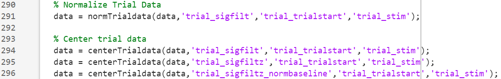

# Trial and Event Analysis
Behavioral paradigms often include discrete trials, or events, where stimuli are presented to the animal throughout the fiber photometry session. Analyzing these events requires parsing the full recording into trials based on event epochs, or timestamps corresponding to the onset and offset of trials. PASTa includes additional functions designed to facilitate the analysis of trial- and event-based paradigms. 

## Extracting Trial Data Streams
To analyze trials that occur during a fiber photometry session, users must first divide the data stream into individual trial streams based on trial start and end timestamps. These timestamps can be automatically integrated with your system via TTLs, or can be manually imported by the user depending on the hardware set up of the lab. Time stamps should be in terms of the corresponding index in the whole session fiber photometry data stream.

Maintaining the proper alignment between the whole session data stream and individual event epochs is essential to properly analyzing trial responses. Trial data are cut into individual trial streams based on trial start and end epochs. Ideally, the start epoch will be set to include a baseline period before the onset of the event (i.e., 5 seconds). This allows analysis of the event response relative to a local baseline. When preparing the trial data streams, ensure all relevant event epochs are also input to the functions to output adjusted epochs that are aligned to the cut trial data streams.

To extract data streams for each individual trial, users can use the function _cutTrialdata_, which required the full data structure, name of the field containing the desired stream to be cut into trials, trial start and end epochs as sample index numbers, and optionally any field names of relevant event epochs to be adjusted to spatially align with the added cut trial data streams.

### Cut Trial Data
Use the _cutTrialdata_ function to extract individual trial data streams from the whole session recording stream.

__REQUIRED INPUTS:__ When calling the _cutTrialdata_ function, specify:

- __data:__ The full data structure containing all session data. The data structure must include (at a minimum) fields with the stream to be cut, the sampling rate of the data stream, trial start epochs, and trial end epochs.

- __trialstreamfieldname:__ The field name containing the whole session data stream to be cut into trial streams.

- __startepocfieldname:__ The name of the field containing the start epochs as sample indexes matched to the whole session data stream to identify the start of each trial.

- __endepocfieldname:__ The name of the field containing the end epochs as sample indexes matched to the whole session data stream to identify the end of each trial.

__OPTIONAL INPUTS:__

- __'epocsfieldnames':__ A cell array of strings to identify the field names of additional relevant trial event epochs to be adjusted to maintain spatial alignment with the cut trial data stream outputs. Include any relevant events, such as stimulus onset and offset.

__OUTPUT:__

_cuttrialdata_ returns the data structure with added fields containing the cut trial data (*data.trial_streamfieldname*), time in seconds of each sample (*data.trial_timeS*), adjusted start and end epochs (*data.trial_startepocfieldname* and *data.trial_endepocfieldname*), and additional fields for any optionally specific additional event epochs.

__Code example:__ 

## Normalization of Trial Data
Depending on the paradigm, users may desire to center or normalize the individual trial data streams relative to the pre-event baseline period of the trial. Note that this can make a large impact on your analysis output, and is not reccomended for experiments that would be expected to drive overall shifts in baseline activity (i.e., pharmacological treatments). In these cases, users should consider normalizing the whole session to a pre-trial period baseline (i.e., first 6 minutes of the session), or avoiding normalization entirely. In the absence of normalization, it may be helpful to center the trial data streams to the trial baseline window to facilitate comparisons of the maximum, minimum, and mean response to the trial event.

PASTa includes options to both center and normalize (Z-score) the individual trial data streams relative to the trial baseline period. These transformations will be added to the data structure in additional fields, and we highly reccomend comparing the experimental outcome across normalization methods (dF/F, whole session Z score, trial baseline centered, trial baseline Z-scored).

### Option 1: Center Trial Data Streams
PASTa includes a function to center trial data streams to a defined trial baseline period. Users must ensure the cut trial data streams include a baseline window before event onset. This is a good option when normalization may alter the scale or shape of the data in a way that obscures experimental effects.

Use the _centerTrialdata_ function to center individual trial data streams to the trial baseline phase.

__REQUIRED INPUTS:__ When calling the _centerTrialdata_ function, specify:

- __data:__ The full data structure containing all session data and fields output by the _cutTrialdata_ function. The data structure must include (at a minimum) fields with the cut trial data streams, trial baseline start epochs, and trial baseline end epochs.

- __trialstreamfieldname:__ The field name containing the individual trial data streams (see _cutTrialdata_ for details).

- __trialBLstartepocfieldname:__ The name of the field containing the baseline start epochs as sample indexes matched to the trial data stream. This is used to identify the start of the baseline window for centering.

- __trialBLendepocfieldname:__ The name of the field containing the baseline end epochs as sample indexes matched to the trial data stream. This is used to identify the end of the baseline window for centering.

__OUTPUT:__

_centerTrialdata_ returns the data structure with an added field containing the centered trial data (*data.trial_streamfieldnamecentered*).

#### Option 2: Normalize (Z Score) Trial Data Streams
PASTa also includes an option to normalize each trial data stream relative to it's own trial baseline period. We reccomend using a pre-event baseline period of at least 3 seconds to ensure stable normalization trends across trials.

Use the _normTrialdata_ function to normalize (Z score) individual trial data streams to the trial baseline phase.

__REQUIRED INPUTS:__ When calling the _normTrialdata_ function, specify:

- __data:__ The full data structure containing all session data and fields output by the _cutTrialdata_ function. The data structure must include (at a minimum) fields with the cut trial data streams, trial baseline start epochs, and trial baseline end epochs.

- __trialstreamfieldname:__ The field name containing the individual trial data streams (see _cutTrialdata_ for details).

- __trialBLstartepocfieldname:__ The name of the field containing the baseline start epochs as sample indexes matched to the trial data stream. This is used to identify the start of the baseline window for normalization.

- __trialBLendepocfieldname:__ The name of the field containing the baseline end epochs as sample indexes matched to the trial data stream. This is used to identify the end of the baseline window for normalization.

__OUTPUT:__

_normTrialdata_ returns the data structure with an added field containing the centered trial data (*data.trial_streamfieldnamez*).

__Code example:__ 

## Quantify Trials
Once trial data streams have been properly cut from the whole session, PASTa includes a function to quantify trial values by phase. Specifically, users can input timestamps that correspond to phases of the trial (i.e., baseline, event 1 onset, event 2 onset, post event period). For each phase, the trial stream will be quantified by the mean, maximum, minimum, standard deviation, and rnage. For phases after the baseline period, additional parameters will be calculated relative to the mean of the trial baseline phase, including maximum value amplitude, mean value amplitude, and phase area under the curve (AUC).

Quantification values are output to a field in the data structure containing one table with all trial values for the session. Optionally, users can input trial identification fields (i.e., trial type, frequency, etc) which will be added to the output table to facilitate downstream analyses.

Use the _quantifyTrials_ function to center individual trial data streams to the trial baseline phase.

__REQUIRED INPUTS:__ When calling the _quantifyTrials_ function, specify:

- __data:__ The full data structure containing all session data and fields output by the _cutTrialdata_ function. The data structure must include (at a minimum) fields with the cut trial data streams, trial phase start epochs, and trial phase end epochs.

- __trialstreamfieldname:__ The field name containing the individual trial data streams (see _cutTrialdata_ for details).

- __trialphasestartfieldname:__ The name of the field containing the start epochs as sample indexes matched to the trial data stream corresponding to the start of each phase (e.g., baseline, stim onset, stim offset) of the trial of interest. Any number of phases can be input to the function.

- __trialphaseendfieldname:__ The name of the field containing the end epochs as sample indexes matched to the trial data stream corresponding to the end of each phase of the trial of interest. The number of end epochs must match the number of start epochs.

__OPTIONAL INPUTS:__

- __'trialphaselabels':__ Cell array of strings; names to label eadch phase provided by the trial event start and end epochs.

- __'trialidfieldnames':__ Cell array of strings; field names of additional fields containing trial ID variables (e.g., trial type, stimulation frequency, stimulus, etc). These will be added to the trial quantification table for each trial.

__OUTPUT:__

_quantifyTrials_ returns the data structure with an added field containing the quantification of all trials by phase. Quantification includes phase mean, max, min, range, and standard deviation. For all phases other than baseline, the table will also include the amplitude of the max and mean relative to baseline and the total area under the curve (AUC).

__Code example:__ 

## Export Trial Quantification
To export trial quantification values for all recording sessions in the data structure, PASTa includes the function _exportTrialQuantification_, which combines the trial quantification from each session and adds user specified fields with experimental metadata (i.e., Subject ID, Session ID, Treatment Group, Treatment Condition, etc). The csv file can be imported into other programs such as R for additional statistical analysis and plotting.

Use the _exportTrialQuantification_ function to output one table with all session trial quantification values.

__REQUIRED INPUTS:__ When calling the _exportTrialQuantification_ function, specify:

- __data:__ The full data structure containing all session data and the _trialquantification_ field output by the _quantifyTrials_ function.

- __trialquantfieldname:__ The field name containing the trial quantification tables to be exported.

- __exportfilepath:__ The path to the folder to output the CSV file to. Note that the path must end with a forward slash.

- __addvariablesfieldnames:__ A cell array containing the names of additional fields from the data structure to include in the trial quantification output. These variables will be added to every row of the output table to facilitate downstream analyses. At a minimum, this should inlcude the subject ID. If multiple sessions per subject are included, ensure a session ID variable is also included. For example: {'Subject', 'SessionID', 'Treatment'}

__OPTIONAL INPUTS:__

- __'exportfilename':__ The name for the saved file output. By default, this will be set to *EXPORTFIELDNAME_AllSessionExport_DAT-MONTH-YEAR.csv*.

__OUTPUT:__

_exportTrialQuantification_ returns the a table with all trial quantification across sessions and saves the csv file to the specified location.

__Code example:__ 

## Find Session Mean Trial Traces
In some cases, users may want to plot or analyze the mean trial response within a session by trial type. To do so, PASTa includes a function to take the mean at each sample included in the trial data streams for all trials of the same trial type, outputting the mean trace across all trials.

Use the _findsessionmeantrialtrace_ function to find the mean trial trace by trial type for each recording session.

__REQUIRED INPUTS:__ When calling the _findsessionmeantrialtrace_ function, specify:

- __data:__ The full data structure containing all session data and fields output by the _cutTrialdata_ function. The data structure must include (at a minimum) fields with the cut trial data streams, a field with trial type spatially matched to the cut trial data streams, and relevant trial phase epochs.

- __trialstreamfieldname:__ The field name containing the individual trial data streams (see _cutTrialdata_ for details).

- __trialtypefieldname:__ The name of the field containing the trial type for each trial. Note that the trial types must be spatially matched with the cut trial data streams, with each trial type in a row corresponding to the row of the cut trial data.

- __trialeventepocfieldnames:__ The names of all fields containing relevant event epochs for the trial. These will be averaged to maintain spatial alignment with the mean trial data stream.

__OPTIONAL INPUTS:__

- __'trialoutputfieldname':__ Output name for the trial ID field. By default, this is set to 'TrialType'.

__OUTPUT:__

_findsessionmeantrialtrace_ returns the data structure with an added field containing the mean trial stream by trial type. Subfields containing the mean data stream and spatially matched trial types and specified event epochs will be nested within the main field *'mean_trialstreamfieldname'*.

__Code example:__ 

